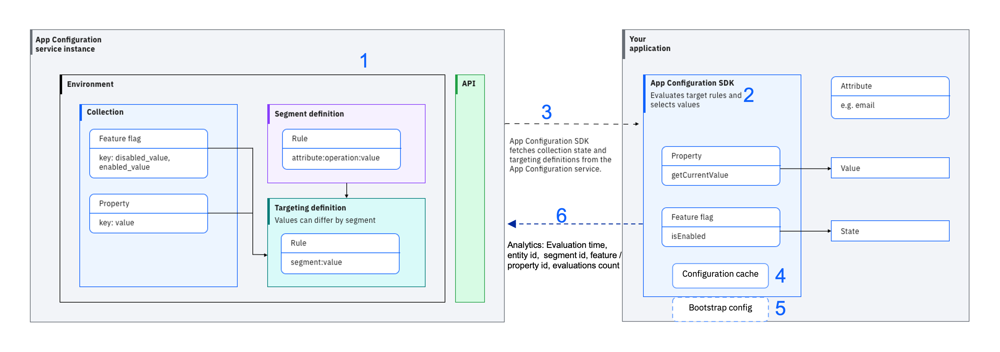
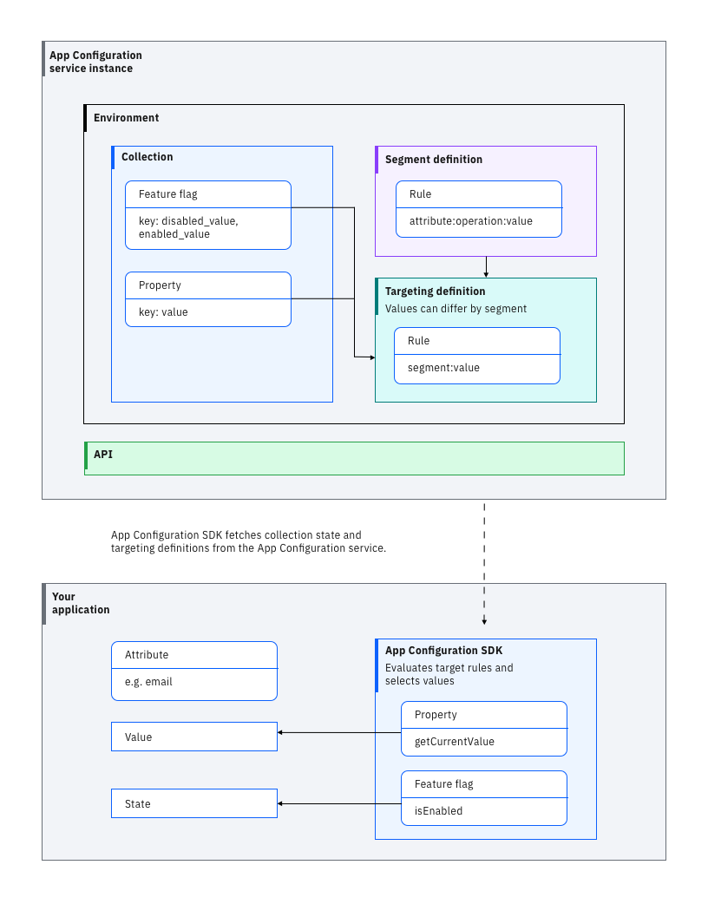

---

copyright:
  years: 2025
lastupdated: "2025-02-06"

keywords: app-configuration, app configuration, about app configuration

subcollection: app-configuration

---

{{site.data.keyword.attribute-definition-list}}

# What is {{site.data.keyword.appconfig_short}}?
{: #ac-about}

{{site.data.keyword.appconfig_notm}} is a centralized feature management and configuration service for use with web and mobile applications, microservices, and distributed environments.
{: shortdesc}

Instrument your applications with {{site.data.keyword.appconfig_short}} SDKs, and use the {{site.data.keyword.appconfig_short}} dashboard or {{site.data.keyword.appconfig_short}} administrator API to define features flags, which are organized into collections and targeted to segments. Change feature flag states in the cloud to activate or deactivate features in your application or environment, often without restarting. You can also manage the properties for distributed applications centrally. It can facilitate a Cloud Governance SME with up-to-date configuration data of IBM Cloud resources in one place so that comprehensive information is available for goverance and compliance initiatives. This can be controlled with the ability to enable or disable the congiguration aggregation.

- **App Owners** - Roll out features by segment and independent from code deployments.
- **Developers** - Reduce source code branch complexity and troublesome merges by including untested or unfinished features behind a feature flag in your main branch.
- **Testers** - Test new features in production and be assured of a smooth transition. Use flags to activate untested features only for testers and QA personnel until it's time to release.

## Features
{: #ac-features}

Key features of {{site.data.keyword.appconfig_short}}:

- **Centralized configuration** - Configure multiple, distributed resources from a central location. Use collections to organize your flags by app or resource.
- **Dark Launch** - Includes features that are not ready for launch into your deployments, and activate them when they are ready.
- **Segmented Feature Rollout** - Activate features for different segments at different times, or vary features by segment.
- **Feature Rollback** - Instantly roll back problematic features by toggling feature flags in the {{site.data.keyword.appconfig_short}} cloud dashboard.
- **Phased Rollout** - Configure feature flag to be enabled for a subset of entities to implement progressive delivery of features.
- **Configuration Aggregator** - Configure to collect the metadata of multiple, distributed resources in IBM Cloud accounts to make available for governance and compliance initiatives.

## How does {{site.data.keyword.appconfig_short}} work?
{: #ac-how-it-works}

Learn how {{site.data.keyword.appconfig_short}} works under normal operation or when something goes wrong.

### Normal operation
{: #ac-normal-operation}

During normal operation, the {{site.data.keyword.appconfig_short}} SDK (#2 in Figure 1) handles the automatic delivery of the appropriate flag state or property value into your application from the {{site.data.keyword.appconfig_notm}} instance (#1 in Figure 1). During initialization, the SDK connects to the {{site.data.keyword.appconfig_short}} API and fetches the specified collections, segment rules, and targeting rules (#3 in Figure 1), and then evaluates the rules against attribute values that are programmed into your application to select the correct [segment](/docs/app-configuration?topic=app-configuration-ac-segments) and target values. Attributes upon which the rules operate are stored locally, and not in the {{site.data.keyword.appconfig_notm}} service on the cloud. Therefore, if you need to evaluate against attributes that are confidential, for example a social security number, the values never leave the local application environment.

After initialization, the application receives updated values in two ways depending on whether you are using server-side or client-side SDKs. Server-side SDKs connect to the {{site.data.keyword.appconfig_short}} service through a web socket, and modified values are delivered your application in real time. Client-side SDKs pull values from the {{site.data.keyword.appconfig_short}} service upon a lifecycle change such being opened or brought to the foreground.

During normal operation, various metrics are sent back to the AC cloud service (#6 in Figure 1) so that the service can operate properly and so that you can monitor its operation.

{: caption="How App Configuration works" caption-side="bottom"}

### Operation when something goes wrong
{: #ac-something-goes-wrong}

As with any application or cloud service, sometimes things go wrong, but {{site.data.keyword.appconfig_notm}} continues to provide configurations even if the {{site.data.keyword.appconfig_notm}} service is not available to your app.

#### Lost connection
{: #ac-lost-connection}

If the connection is lost between your application and the {{site.data.keyword.appconfig_notm}} service, the {{site.data.keyword.appconfig_notm}} SDK automatically falls back to a local cache file that contains the last known good configuration (#4 in Figure 1). In cache mode, changes to configurations that occur in the cloud do not reach the app, but the configuration that existed at the time of the lost connection continue to operate normally.

As an extension of this case, assume that you need to operate your app an air-gapped environment. For that case, you can use a bootstrap config file (#5 in Figure 1). For more information, see [Enable offline mode](/docs/app-configuration?topic=app-configuration-ac-offline).

#### Service down
{: #ac-service-down}

The likelihood of the {{site.data.keyword.appconfig_notm}} service goes down is low. {{site.data.keyword.appconfig_short}} is deployed into multi-zone regions, meaning it runs across three geographically separate zones within a region. If any zone goes down, the {{site.data.keyword.appconfig_notm}} service continues to operate normally. For more information, see [Region and data center locations for resource deployment](/docs/overview?topic=overview-locations).

In cases where you need extreme disaster recovery protection that spans regions, you can set up {{site.data.keyword.appconfig_notm}} instances in other regions and keep them in sync by using the [{{site.data.keyword.appconfig_notm}} API](/apidocs/app-configuration).

## {{site.data.keyword.appconfig_short}} concepts
{: #ac-overview}

Learn about {{site.data.keyword.appconfig_short}} concepts like service instance, targeting definition, and feature flag.

{: caption="{{site.data.keyword.appconfig_short}} overview" caption-side="bottom"}

### Service instance
{: #ac-service-instance}

An {{site.data.keyword.appconfig_short}} service instance is your copy of the {{site.data.keyword.appconfig_short}} application on the {{site.data.keyword.cloud_notm}}. You create an instance from the tile in the {{site.data.keyword.cloud_notm}} catalog. Now you have access to the {{site.data.keyword.appconfig_short}} dashboard and all the functions that come with the selected pricing plan.

### Environment
{: #ac-environment}

{{site.data.keyword.appconfig_short}} environments are sets of configuration values that are applied to the environments you run and manage in your infrastructure. For example, your software development process might involve three environments: development, staging, and production. Configuration values for all three can be present in a single instance of {{site.data.keyword.appconfig_short}}. All configuration keys (names) automatically replicate across all environments inside {{site.data.keyword.appconfig_short}}, but the values for each key are specific to each environment.

### Collection
{: #ac-collection}

Use collections to group feature flags and properties in any way that is meaningful to you. Often a collection is used to represent all configuration values for a particular application. Feature flags and properties can belong to more than one collection for cases where you want to share a common configuration value across apps or sets of infrastructure.

### Feature flags
{: #ac-fefl}

Feature flags are configuration parameters that you want to turn on and off quickly or frequently. They can be used to set the state of your application. Within your application, the `isEnabled()` method of the {{site.data.keyword.appconfig_short}} SDK is used to activate conditional blocks of code to turn features on and off based on the state of a feature flag. Use feature flags to dark launch features into production and then switch them on only for selected users or roll them out to your users selectively and independently from deployments. Each feature flag must belong to a collection.

### Properties
{: #ac-propertydef}

Properties are configuration parameters that don't change often, but that still need centralized management. Consolidate properties for all your app and environment components into one central cloud dashboard, with {{site.data.keyword.appconfig_short}}, thus avoiding the hassle of managing multiple parameter files. Within your application, the `getCurrentValue()` method of the {{site.data.keyword.appconfig_short}} SDK is used to access the current value of a property. Each property must belong to a collection.

### Segments
{: #ac-segmentdef}

Using {{site.data.keyword.appconfig_short}}, a single feature flag, or property, can have many values, with each value applied to a specific group of entities (users, devices, infrastructure components). Each group is called a segment. Members of a segment share one or more common attributes as defined by a set of segment rules. Segments are optional.

### Attribute
{: #ac-attribute}

An attribute is a parameter that is used to define a segment. Attributes are used to create segment rules on the {{site.data.keyword.appconfig_short}} dashboard, but names of the attributes and values of each attribute are defined in your code. At run time, the {{site.data.keyword.appconfig_short}} SDK fetches the segment rules into your application instance and determine whether it is a part of the segment.

### Targeting definition
{: #ac-targetdef}

Feature flags and properties are targeted to segments based on a set of rules that are called the targeting definition. With targeting, you can override the default value for a flag or property, for any segment you define. 

### {{site.data.keyword.appconfig_short}} SDK
{: #ac-sdk-concept}

The {{site.data.keyword.appconfig_short}} SDK handles the automatic delivery of the appropriate flag state or property value into your application. It connects to the endpoints provided by the {{site.data.keyword.appconfig_short}} API, fetches collections, and evaluates segment and targeting rules. It also provides option to enable or disable the configuraton aggregator and query for the resource metadata. Server-side SDKs connect to the {{site.data.keyword.appconfig_short}} service through a web socket for real-time updates. Client-side SDKs pull values from the {{site.data.keyword.appconfig_short}} service upon a lifecycle change such being opened or brought to the foreground. SDKs are available in various client-side and serve-side languages, and more languages are being added all the time.
