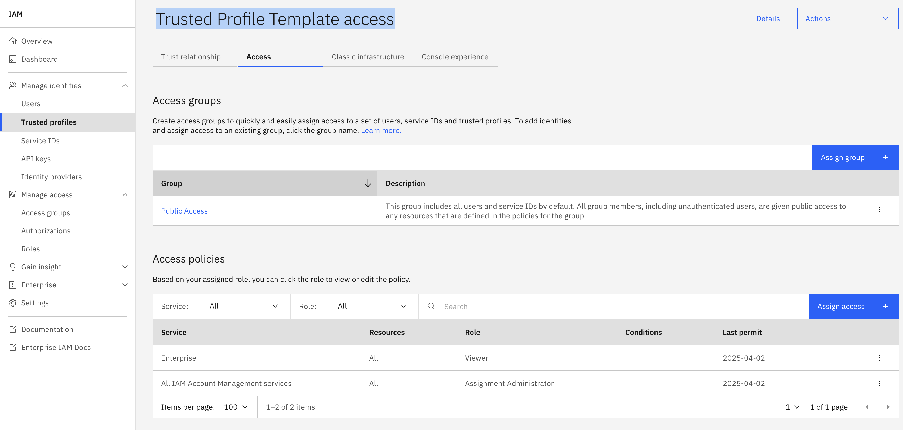
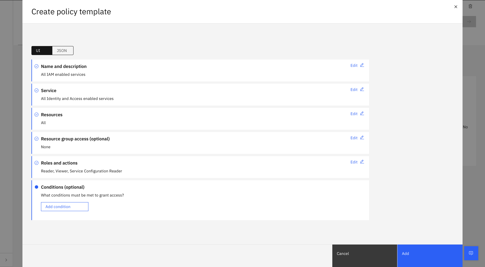
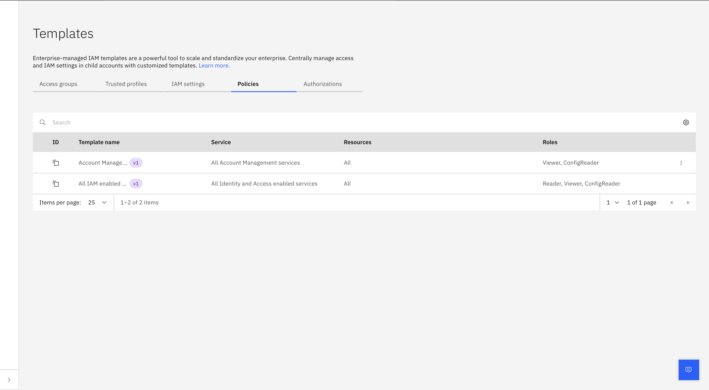
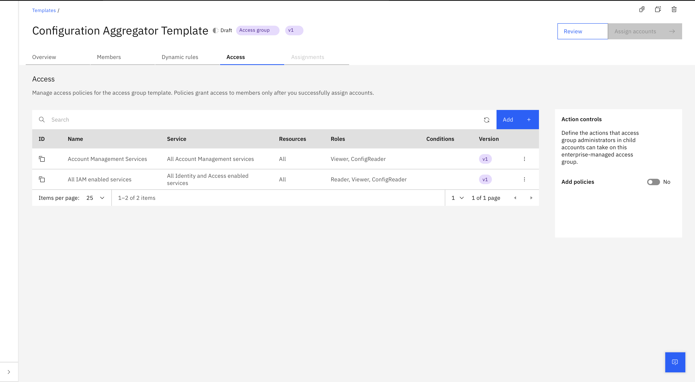
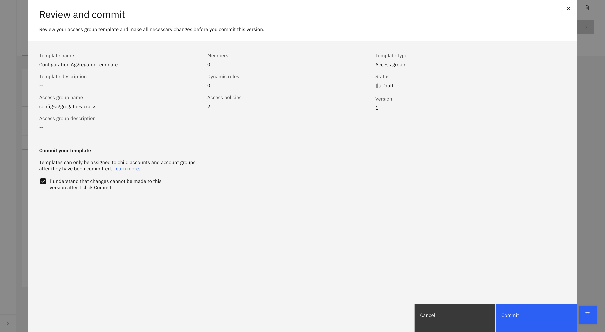
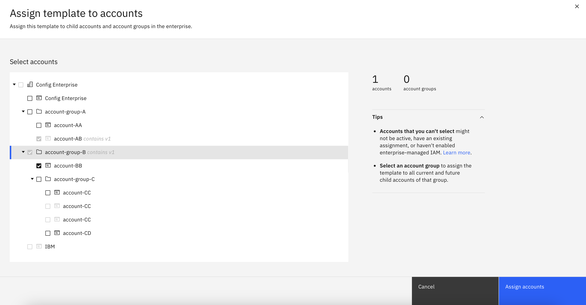
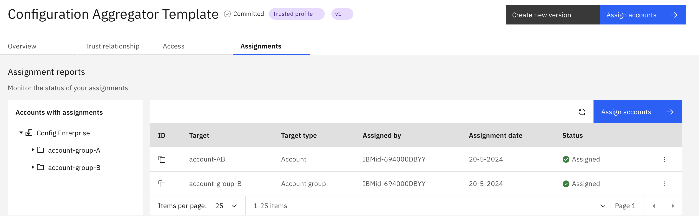
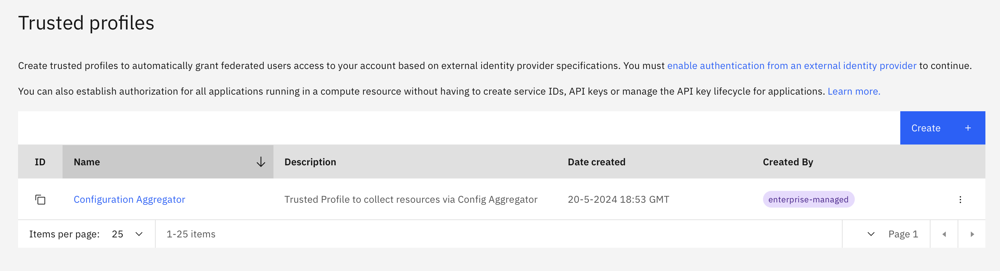

---

copyright:
   years: 2025
lastupdated: "2025-01-09"

keywords: app-configuration, app configuration,enable configuration aggregation,tutorial

subcollection: app-configuration

content-type: tutorial
account-plan: standard
completion-time: 40m

---

{{site.data.keyword.attribute-definition-list}}

# Working with Configuration Aggregator as a support for Enterprise Accounts
{: #ac-configaggregator-tutorial}
{: toc-content-type="tutorial"}
{: toc-completion-time="40m"}

This tutorial shows how the [Configuration Aggregator](/docs/app-configuration?topic=app-configuration-ac-configuration-aggregator) feature can be configured on an {{site.data.keyword.appconfig_short}} instance at Enterprise account level to collect resource metadata from all the sub-accounts of the enterprise.
{: shortdesc}

## Before you begin
{: #ac-prereqs-ca}

Ensure that the following prerequisites are in place:

* Create an {{site.data.keyword.appconfig_short}} instance at the top-level of the enterprise i.e enterprise account.
* Create a Trusted Profile Template providing access for the App Configuration service instance to the IAM enabled services and Account Management services. See section below on the Steps to create the Trusted profile template.
* Assign the Trusted profile template to the required accounts and account groups in the Enterprise. This will create the trusted profiles in all the selected accounts.
* App Configuration needs access to read the trusted profile templates. Create a trusted profile with access for Template Administrator, Assignment Administrator, viewer on All IAM Account Management services.
   {: caption="Creating a trusted profile on IAM" caption-side="bottom"}

The Enterprise IAM should be enabled in the sub-accounts of an Enterprise to be managed via Enterprise. Ensure that this option is enabled, or you can modify it using the below API.

```curl
curl -s -L -X PATCH "https://accounts.test.cloud.ibm.com/v1/accounts/$ACCOUNT/traits" 
-H "Content-Type: application/json" 
-H "Authorization: Bearer $TOKEN" 
-d "{
    \"enterprise_iam_managed\": true
}"
```
{: codeblock}

If the trusted profile template is applied to an account group, then all the accounts and account group added in the future will also get assigned to the trusted profile template automatically.
{: note}

## Steps for Creating a Trusted Profile Template

   **Step 1: Create policy templates** 
   
   Create policy templates so that it can be used in a Trusted Profile Template. For the Configuration Aggregator functionality, the policy would need access to `All IAM enabled services` with `Reader, Viewer and ConfigReader` roles & `All Account Management services` with `Viewer and Config Reader` role. 
   
   The policy template can be created using API or UI. 
   
   Refer - 
   
   API: https://cloud.ibm.com/docs/secure-enterprise?topic=secure-enterprise-policy-template-create&interface=api 

   UI: 
   
   Navigate to the Access tab in your template and click on Add -> Create. Define the name and description. Select the service you want assign access to and assign the level of access.

   {: caption="Creating Policy Templates" caption-side="bottom"}

   Once the policy has been created, select all the policies you want and click on add. 

   The policy templates created are as below : 
   
   {: caption="Reviewing Policy Templates" caption-side="bottom"}

---
   **Step 2: Create Trusted Profile Template with IBM Cloud service instance as a trusted identity**
   
   In order to create a Trusted Profile template with IBM Cloud service instance as a trusted identity, you need to use the APIs. Also ensure to use `type: crn` for the identities. Refer for more details : https://cloud.ibm.com/docs/secure-enterprise?topic=secure-enterprise-tp-template-create&interface=api#create-trusted-profile-template-api.
   
   **Payload for creating trusted profile template:** 
   
   ```
   POST https://iam.test.cloud.ibm.com/v1/profile_templates
   ```
   
   ```json
   {
     "account_id": "c1d20fee2fe24c42b8ef6583283d2dcf",
     "name": "Configuration Aggregator Template", 
     "description": "Trusted profile template for Config Aggregator to collect resources from services",
      "profile": {
           "name": "Configuration Aggregator",
           "description": "Trusted Profile to collect resources via Config Aggregator",
           "identities": [
             {
               "type": "crn",
               "identifier": "crn:v1:staging:public:apprapp-dev:us-south:a/c1d20fee2fe24c42b8ef6583283d2dcf:8abc9e31-5e7e-4154-b2d1-e963ee8a85a2::",
               "description": "App Configuration Dev instance in Enterprise account"
             }
           ]
       },
       "policy_template_references": [
         {
           "id": "policyTemplate-1362f690-8e7f-4a0a-bf72-bb8e5a0008c5",
           "version": "1"
         },
         {
           "id": "policyTemplate-2ba51f58-7b02-47ba-a707-1916d4650cbf",
           "version": "1"
         }
       ]
   }
   ```
   `identities.identifier` refers to the App Configuration instance CRN that is being configured for Configuration Aggregator. 
   `policy_template_references.id` refers to the id of the policy templates created in previous step. 
   
Once the template is created it will show up in draft mode.
   
---
   
   **Step 3: Commit the template**
   
   Once we have all the details such as policy and identities in place then you can make an update, review it and mark it as committed.

   {: caption="Reviewing Policies for the Template" caption-side="bottom"}

   {: caption="Committing the policies" caption-side="bottom"}


  
   **Step 4: Assign accounts to the templates**
   
   Once the template is committed, it can be used for assignments. You can use the UI or API for this. You can do assignments only to the accounts that have `enterprise_iam_managed` enabled. 
   
   - API: https://cloud.ibm.com/docs/secure-enterprise?topic=secure-enterprise-tp-template-create&interface=api#assign-trusted-profile-template-api
   - UI: https://cloud.ibm.com/docs/secure-enterprise?topic=secure-enterprise-tp-template-create&interface=ui#assign-trusted-profile-template-api
   
   {: caption="Selecting Accounts you want to assign" caption-side="bottom"}
   
   
   {: caption="Assigning the accounts" caption-side="bottom"}

   Once the assignment is complete, the trusted profile will be created in all the sub-accounts. It can be validated by checking the accounts that shows that the trusted profile is enterprise-managed.
   
   {: caption="Trusted Profile template visible in all accounts" caption-side="bottom"}


   **Step 5: Configure the Configuration Aggregator**
   
   Configure the Configuration aggregator using the [Settings API](/apidocs/app-configuration#replace-settings). See the API documentation for more details. 
