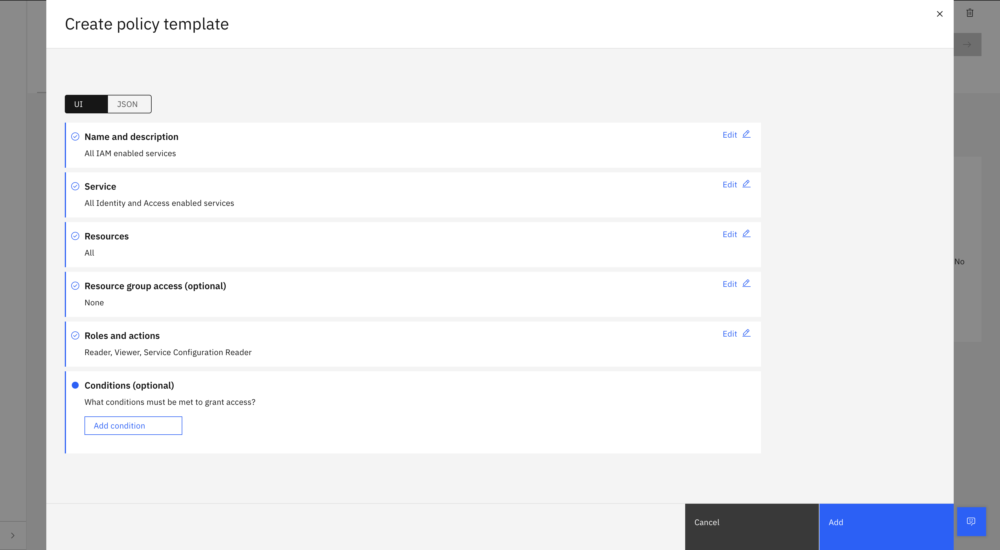
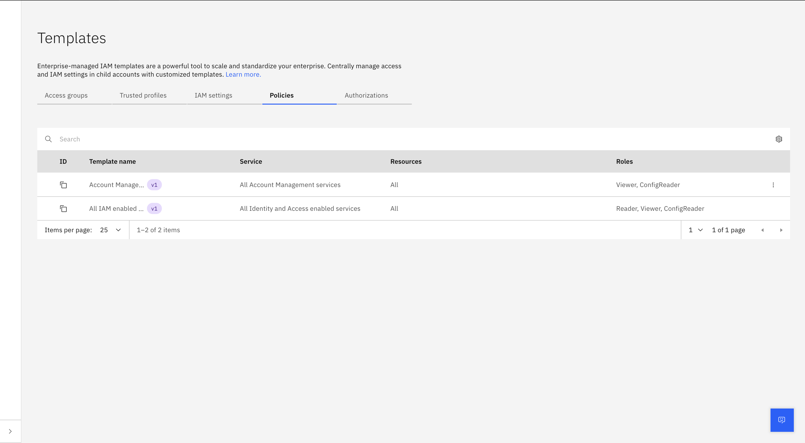
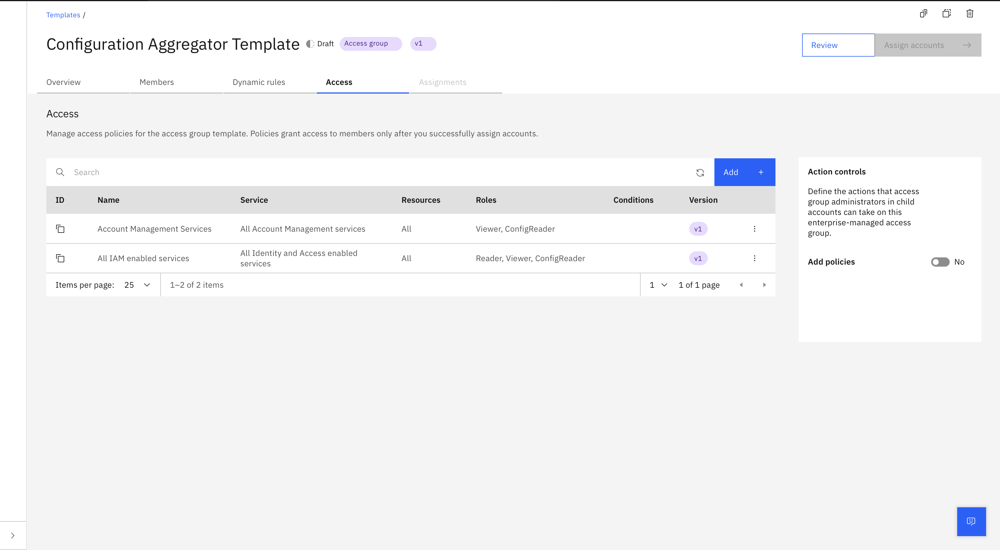
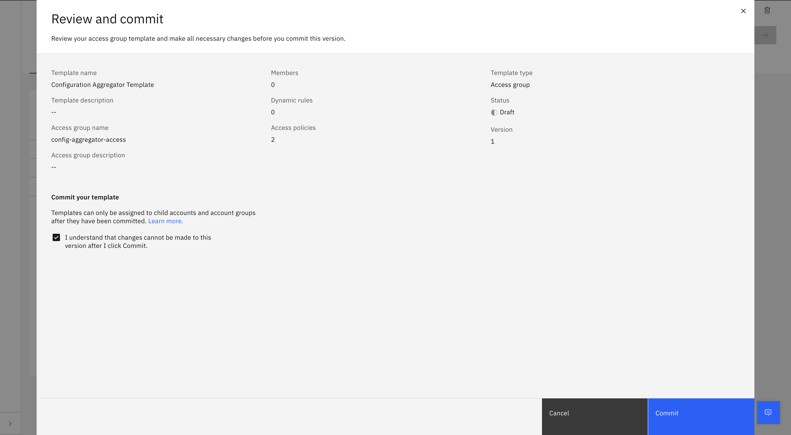
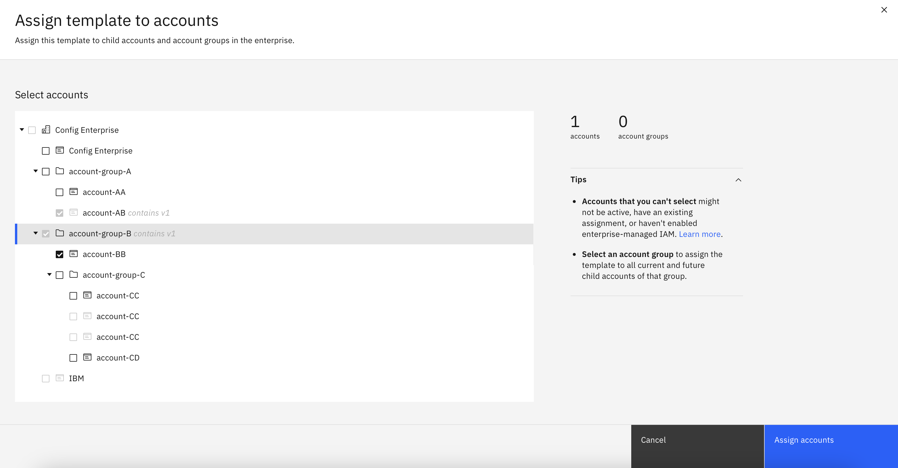
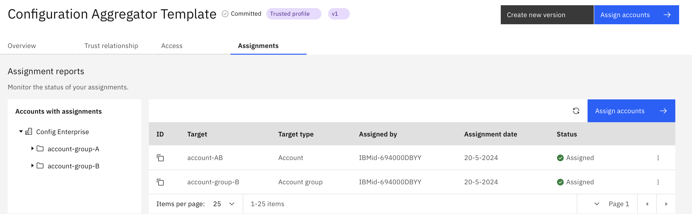
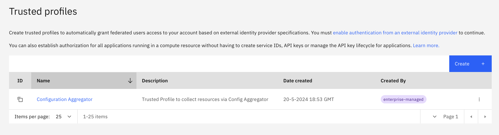

---

copyright:
   years: 2024, 2026
lastupdated: "2026-03-23"

keywords: configuration aggregator, enterprise accounts, trusted profile template, policy templates, enterprise IAM

subcollection: app-configuration

content-type: tutorial
services: app-configuration
account-plan: standard
completion-time: 40m

---

{{site.data.keyword.attribute-definition-list}}

# Setting up Configuration Aggregator for enterprise accounts
{: #ac-configaggregator-tutorial}
{: toc-content-type="tutorial"}
{: toc-services="app-configuration"}
{: toc-completion-time="40m"}

In this tutorial, you learn how to set up the Configuration Aggregator in {{site.data.keyword.appconfig_short}} at the enterprise account level to collect resource metadata from all child accounts in your enterprise.
{: shortdesc}

## Objectives
{: #ac-configaggregator-tutorial-objectives}

In this tutorial, you complete the following tasks:

- Create policy templates for Configuration Aggregator access.
- Create a trusted profile template with your {{site.data.keyword.appconfig_short}} instance as a trusted identity.
- Commit the trusted profile template.
- Assign the template to enterprise accounts.
- Set up Configuration Aggregator to collect resource metadata from the enterprise. 

## Before you begin
{: #ac-prereqs-ca}

Make sure you have the following prerequisites:

- An {{site.data.keyword.cloud_notm}} enterprise account. For more information about creating an enterprise, see [What is an enterprise?](/docs/secure-enterprise?topic=secure-enterprise-what-is-enterprise)
- An {{site.data.keyword.appconfig_short}} instance created at the enterprise account level. For more information, see [Creating an {{site.data.keyword.appconfig_short}} service instance](/docs/app-configuration?topic=app-configuration-ac-create-an-instance).
- Manager access to the {{site.data.keyword.appconfig_short}} service.
- Administrator access to IAM Account Management services in the enterprise account.
- Enterprise IAM enabled in all child accounts that you want to manage. You can verify or enable this setting by using the following API call:

   ```bash
  curl -s -L -X PATCH "https://accounts.cloud.ibm.com/v1/accounts/$ACCOUNT/traits"
  -H "Content-Type: application/json"
  -H "Authorization: Bearer $TOKEN"
  -d "{
    \"enterprise_iam_managed\": true
  }"
   ```
   {: codeblock}

   Replace `$ACCOUNT` with your account ID and `$TOKEN` with your IAM access token.

If you apply the trusted profile template to an account group, all accounts added to that group in the future automatically receive the trusted profile template assignment.
{: tip}

## Create policy templates
{: #tutorial-create-policy-templates}
{: step}

Policy templates define the access permissions that Configuration Aggregator needs to collect resource metadata from your enterprise accounts. You need to create policy templates that grant the following access:

- Reader, Viewer, and ConfigReader roles on All IAM-enabled services. 
- Viewer and ConfigReader roles on All Account Management services.

You can create policy templates by using the {{site.data.keyword.cloud_notm}} console or [API](/docs/secure-enterprise?topic=secure-enterprise-policy-template-create&interface=api).

1. In the {{site.data.keyword.cloud_notm}} console, go to **Manage** > **Access (IAM)** > **Templates**.
2. Click **Create** to create a new policy template.
3. In the **Access** tab, click **Add** > **Create**.
4. Enter a name and description for your policy template.
5. Select the service that you want to assign access to.
6. Assign the following access: 
    - Reader, Viewer, and ConfigReader roles on All IAM-enabled services. 
    - Viewer and ConfigReader roles on All Account Management services.
7. Click **Add** to save the policy.

The following image shows the policy creation interface where you define the name, description, and access levels:

{: caption="Creating policy templates" caption-side="bottom"}

After you create all the required policies, select them and click **Add** to include them in your template.

The following image shows the completed policy templates ready for use:

{: caption="Reviewing policy templates" caption-side="bottom"}

## Create a trusted profile template
{: #tutorial-create-trusted-profile-template}
{: step}

A trusted profile template allows your {{site.data.keyword.appconfig_short}} instance to access resources across your enterprise accounts. You must create this template by using the IAM API and specifying your {{site.data.keyword.appconfig_short}} instance CRN as a trusted identity.

To create a trusted profile template, make a POST request to the IAM profile templates endpoint:

```bash
POST https://iam.cloud.ibm.com/v1/profile_templates
```
{: pre}

Use the following JSON payload as the request body:

```json
{
  "account_id": "YOUR_ENTERPRISE_ACCOUNT_ID",
  "name": "Configuration Aggregator Template",
  "description": "Trusted profile template for configuration aggregator to collect resources from services",
  "profile": {
    "name": "Configuration Aggregator",
    "description": "Trusted profile to collect resources through configuration aggregator",
    "identities": [
      {
        "type": "crn",
        "identifier": "YOUR_APP_CONFIGURATION_INSTANCE_CRN",
        "description": "App Configuration instance in enterprise account"
      }
    ]
  },
  "policy_template_references": [
    {
      "id": "YOUR_POLICY_TEMPLATE_ID_1",
      "version": "1"
    },
    {
      "id": "YOUR_POLICY_TEMPLATE_ID_2",
      "version": "1"
    }
  ]
}
```
{: codeblock}

Replace the following values in the payload:

- `YOUR_ENTERPRISE_ACCOUNT_ID`: Your enterprise account ID
- `YOUR_APP_CONFIGURATION_INSTANCE_CRN`: The CRN of your {{site.data.keyword.appconfig_short}} instance that you want to configure for Configuration Aggregator
- `YOUR_POLICY_TEMPLATE_ID_1` and `YOUR_POLICY_TEMPLATE_ID_2`: The IDs of the policy templates that you created in the previous step

When you use `type: crn` for identities, you specify a service instance as a trusted identity. For more information, see [Creating a trusted profile template](/docs/secure-enterprise?topic=secure-enterprise-tp-template-create&interface=api#create-trusted-profile-template-api).

After you create the template, it appears in draft mode and is ready for review.

## Commit the template
{: #tutorial-commit-the-template}
{: step}

After you create the trusted profile template with all the required policies and identities, you need to review and commit it before you can assign it to accounts.

1. In the {{site.data.keyword.cloud_notm}} console, go to **Manage** > **Access (IAM)** > **Templates**.
2. Locate your Configuration Aggregator template in the list.
3. Review the template details, including the policies and trusted identities.
4. Click **Commit** to finalize the template.

The following image shows the policy review interface where you can verify all policies attached to the template:

{: caption="Reviewing policies for the template" caption-side="bottom"}

The following image shows the commit interface where you finalize the template:

{: caption="Committing the template" caption-side="bottom"}

After you commit the template, it becomes available for assignment to enterprise accounts and account groups.

## Assign the template to child accounts
{: #tutorial-assign-accounts-templates}
{: step}

After you commit the template, you can assign it to enterprise accounts or account groups. You can assign templates only to accounts that have [enterprise-managed IAM enabled](/docs/enterprise-management?topic=enterprise-management-enterprise-managed-opt-in&interface=ui).

You can assign the template by using the {{site.data.keyword.cloud_notm}} console or [API]((/docs/secure-enterprise?topic=secure-enterprise-tp-template-create&interface=api#assign-trusted-profile-template-api))

1. In the {{site.data.keyword.cloud_notm}} console, go to **Manage** > **Access (IAM)** > **Templates**.
2. Locate your Configuration Aggregator template and click **Assign**.
3. Select the accounts or account groups that you want to assign the template to. 
4. Review your selections and click **Assign**.

The following image shows the account selection interface where you choose which accounts receive the template:

{: caption="Selecting accounts for template assignment" caption-side="bottom"}

The following image shows the assignment confirmation interface:

{: caption="Confirming account assignments" caption-side="bottom"}

After the template is assigned, the trusted profile is created in all the child accounts you selected. You can verify the assignment by checking each account to confirm that the trusted profile appears as enterprise-managed.

The following image shows how the trusted profile appears in child accounts after it's been assigned:

{: caption="Trusted profile visible in assigned accounts" caption-side="bottom"}

## Enable configuration aggregator 
{: #tutorial-configure-config-aggregator}
{: step}

After you assign the trusted profile template to your enterprise accounts, you can enable Configuration Aggregator in your {{site.data.keyword.appconfig_short}} instance.

You can enable Configuration Aggregator by using the [{{site.data.keyword.appconfig_short}} Settings API](/apidocs/app-configuration).

You can also choose to use [Terraform IBM Modules (TIM) for {{site.data.keyword.appconfig_short}}](https://registry.terraform.io/modules/terraform-ibm-modules/app-configuration/ibm/latest){: external} that has built-in support for Configuration Aggregator, automatically provisioning the necessary Trusted Profiles, templates, and custom IAM roles which enables a fully-automated approach to configure and manage an {{site.data.keyword.appconfig_short}} instance at Enterprise account level.
{: note}
