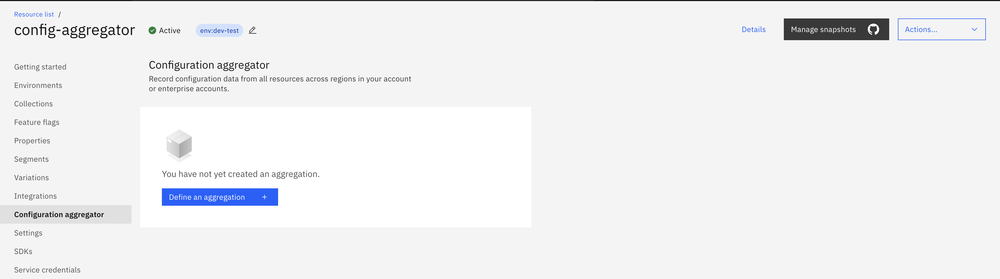
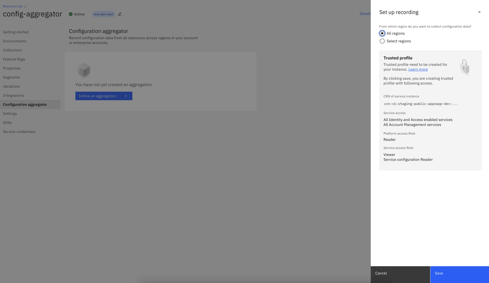
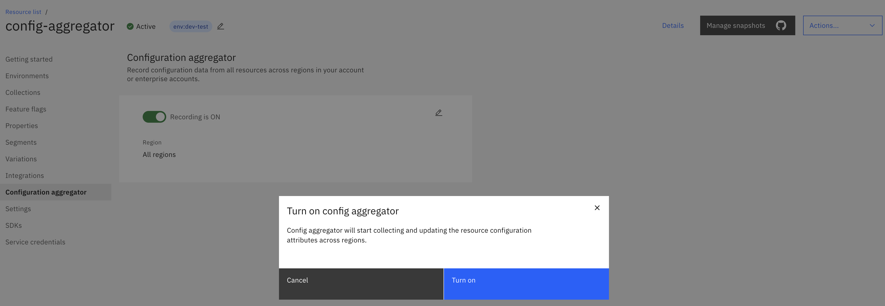
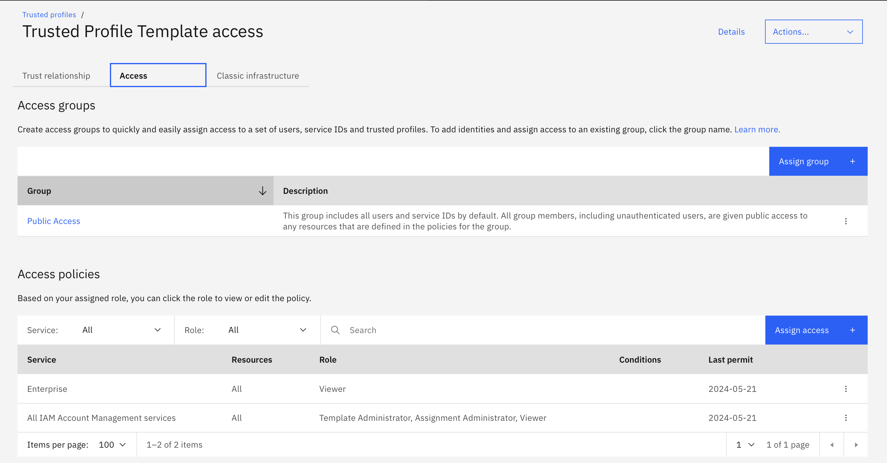
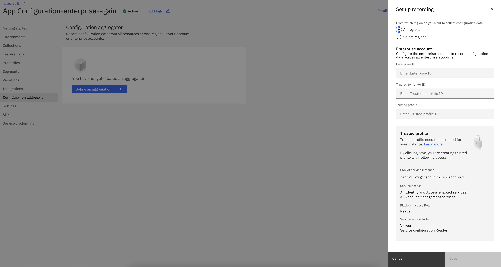
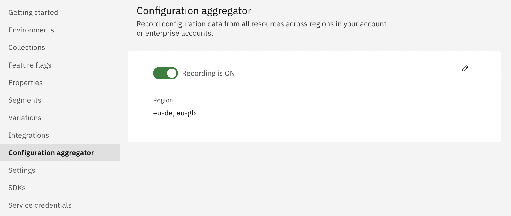

---

copyright:
  years: 2020, 2025
lastupdated: "2025-01-31"

keywords: app-configuration, app configuration, enable configuration aggregation

subcollection: app-configuration

---

{{site.data.keyword.attribute-definition-list}}

# Configuration Aggregator
{: #ac-configuration-aggregator}

Configuration Aggregator can be used to facilitate a Cloud Governance SME with up-to-date configuration data of IBM Cloud resources in one place so that comprehensive information is available for goverance and compliance initiatives. All the plans of the {{site.data.keyword.appconfig_short}} service will have the Configuration Aggregator feature available. As an app owner, the user has to explicitly enable the Configuration Aggregator. It can be done on the {{site.data.keyword.appconfig_short}} instance either via API, SDK or Dashboard. The {{site.data.keyword.appconfig_short}} service will start the resource collection and periodically to keep the metadata current via reconciliation. User can use the query API to get the updated metadata of the service instances in the account.

Configuration Aggregator feature can be configured on an {{site.data.keyword.appconfig_short}} instance at Enterprise account level to collect resource metadata from all the sub-accounts of the enterprise. A trusted profile template should be created providing access to {{site.data.keyword.appconfig_short}} service instance to all the IAM enabled services. The trusted profile template should then be assigned to the required accounts in the Enterprise, which in turn creates the trusted profile in the respective sub-accounts providing access to App Configuration service instance to collect resource metadata.

By default, recording is always set to be OFF.
{: shortdesc}

{: caption="Default Configuration Aggregator" caption-side="bottom"}

## Enable Configuration aggregator - Single Account
{: #ac-enable-configuration-aggregator-single-account}

To enable configuration aggregator, complete these steps:

1. In the {{site.data.keyword.appconfig_short}} console, click **Configuration aggregator**.

1. Click on **Define an aggregation**. The side panel opens with fields for setting up recording details.

   {: caption="Set up recording - Single Account" caption-side="bottom"}

1. Select either **all regions** or specific regions from the **region** list. Click on **Save** to complete. This will create a Trusted Profile on {{site.data.keyword.appconfig_short}} instance having reader access for reading the configurations of the resources.

1. Click on toggle button to enable recording. It will ask for confirmation. Click on **Turn on** button.

   {: caption="Enable Recording - Single Account" caption-side="bottom"}

## Enable Configuration aggregator - Enterprise Account
{: #ac-enable-configuration-aggregator-enterprise-account}

**In order to enable configuration aggregator feature for enterprise account, user must complete following Pre-requisities**:

1. Create an {{site.data.keyword.appconfig_short}} instance at the top-level of the enterprise i.e enterprise account.

1. Create a Trusted Profile Template providing access for the {{site.data.keyword.appconfig_short}} service instance to the IAM enabled services and Account Management services. Refer [here](/docs/enterprise-management?topic=enterprise-management-tp-template-create)

   {: caption="Trusted Profile Template - Enterprise Account" caption-side="bottom"}

The trusted profile template cannot be assigned to the enterprise account i.e the top level account of the enterprise. If you choose to collect metadata of resources in the enterprise account, you should create a separate trusted profile that should be applied at the top level account additionally.
{: note}

1. Assign the Trusted profile template to the required accounts and account groups in the Enterprise.

The Enterprise IAM should be enabled in the sub-accounts of an Enterprise to be managed via Enterprise. For more details, refer [here](/docs/enterprise-management?topic=enterprise-management-enterprise-managed-opt-in)
{: note}

To enable configuration aggregator for an enterprise account, complete above pre-requisites and following steps:

1. In the {{site.data.keyword.appconfig_short}} console, click **Configuration aggregator**.

1. Click on **Define an aggregation**. The side panel opens with fields for setting up recording details.

   {: caption="Set up recording - Enterprise Account" caption-side="bottom"}

1. Provide the Set up record details:
   - **Region** - regions from which user wants to collect configuration data.
   - **Enterprise ID** - enterprise account id.
   - **Trusted template ID** - trusted profile template id created as pre-requisite.
   - **Trusted profile ID** - trusted profile id created as pre-requisite.

1. Click **Save**.

1. Click on toggle button to enable recording. It will ask for confirmation. Click on **Turn on** button.

   {: caption="Enable Recording - Enterprise Account" caption-side="bottom"}

## Retrieve Resource Metadata
{: #ac-enable-configuration-aggregator-query-configs}

We can query for the configurations of IBM Cloud resources using list API. It will provide with the detailed metadata of the resources when Configuration Aggregator is enabled for an {{site.data.keyword.appconfig_short}} instance.
For more details, refer [here](/apidocs/app-configuration){: external}.

## List of Services Supported by Configuration Aggregator
{: #ac-list-of-services-configaggregator}

Configuration Aggregator supports the following services:

| Name of service |
|-----------------|
| [Cloud Object Storage](/docs/cloud-object-storage) |
| [Kubernetes Service](/docs/containers) |
| [Red Hat OpenShift](/docs/openshift) |
| [Virtual server for VPC](/docs/vpc?topic=vpc-creating-virtual-servers) |
| [Virtual Private Cloud](/docs/vpc) |
| [Block storage volume for VPC](/docs/vpc?topic=vpc-creating-block-storage) |
| [Block storage snapshots for VPC](/docs/vpc?topic=vpc-snapshots-vpc-create) |
| [Secrets Manager](/docs/secrets-manager) |
| [Databases for PostgreSQL](/docs/databases-for-postgresql) |
| [Databases for Redis](/docs/databases-for-redis) |
| [Databases for ElasticSearch](/docs/databases-for-elasticsearch) |
| [Databases for EnterpriseDB](/docs/databases-for-enterprisedb) |
| [Databases for ETCD](/docs/databases-for-etcd) |
| [Databases for MongoDB](/docs/databases-for-mongodb) |
| [Databases for MySQL](/docs/databases-for-mysql) |
| [Identity and Access Management](/docs/account?topic=account-cloudaccess) |
| [Key Protect](/docs/key-protect) |
| [Container Registry](/docs/Registry?topic=Registry-getting-started) |
| [Load Balancer for VPC](/docs/loadbalancer-service) |
| [Security Group for VPC](/docs/vpc?topic=vpc-using-security-groups) |
| [SSH Keys for VPC](/docs/vpc?topic=vpc-ssh-keys) |
| [Subnet for VPC](/docs/vpc?topic=vpc-about-subnets-vpc) |
| [Virtual Private Endpoint (VPE) for VPC](/docs/vpc?topic=vpc-ordering-endpoint-gateway&interface=ui) |
| [Auto Scale (Instance Group) for VPC](/docs/vpc?topic=vpc-creating-auto-scale-instance-group) |
| [Bare Metal servers for VPC](/docs/vpc?topic=vpc-planning-for-bare-metal-servers) |
| [Client VPN for VPC](/docs/vpc?topic=vpc-vpn-client-to-site-overview) |
| [Dedicated Host for VPC](/docs/vpc?topic=vpc-creating-dedicated-hosts-instances) |
| [Floating IP for VPC](/docs/vpc?topic=vpc-fip-about) |
| [Flow Logs](/docs/vpc?topic=vpc-flow-logs) - VPC |
| [Custom image for VPC](/docs/vpc?topic=vpc-planning-custom-images) |
| [Placement Groups for VPC](/docs/vpc?topic=vpc-about-placement-groups-for-vpc) |
| [Code Engine](/docs/codeengine) |
| [Network ACL - VPC](/docs/vpc?topic=vpc-using-acls) |
| [DNS Service - VPC](/docs/dns-svcs) |
| [VPN for VPC](/docs/vpc?topic=vpc-about-networking-for-vpc#external-connectivity) |
| [IBM Cloud Backup - VPC](/docs/vpc?topic=vpc-backup-service-about) |
| [Public Gateway](/docs/vpc?topic=vpc-vpn-create-gateway) |
| [Event Streams (messagehub)](/docs/EventStreams) |
| [IBM Cloud Direct Link](/docs/dl) |
| [Transit Gateway](/docs/transit-gateway) |
| [Toolchain](/docs/ContinuousDelivery) |
| [IBM Cloudant CLI](/docs/Cloudant-cli-plugin) |
| [IBM Cloud Internet Services (CIS)](/docs/cis) |
| [Schematics](/docs/schematics) |
| [Cloud Monitoring](/docs/monitoring?topic=monitoring-getting-started#getting-started)|
| [Security and Compliance Center (SCC)](/docs/security-compliance) |
| [Hyper Protect Crypto Services (HPCS)](/docs/hs-crypto) |
| [App ID](/docs/appid) |
| [App Configuration](/docs/app-configuration) |
| [Catalog Management](/docs/account?topic=account-restrict-by-user&interface=ui) |
| [Event Notifications](/docs/event-notifications) |
| [Messages for RabbitMQ](/docs/messages-for-rabbitmq) |
| [IBM Cloud Projects](/docs/secure-enterprise?topic=secure-enterprise-understanding-projects) |
| [IBM Cloud Activity Tracker](/docs/activity-tracker)|
| [IBM Cloud Activity Tracker Event Routing](/docs/atracker) |
| [watsonx.ai Runtime](https://dataplatform.cloud.ibm.com/docs/content/wsj/analyze-data/ml-overview.html?context=cpdaas) |
| [IBM Power Virtual Server](/docs/power-iaas) |
{: caption="List of services supported by Configuration Aggregator" caption-side="bottom"}
