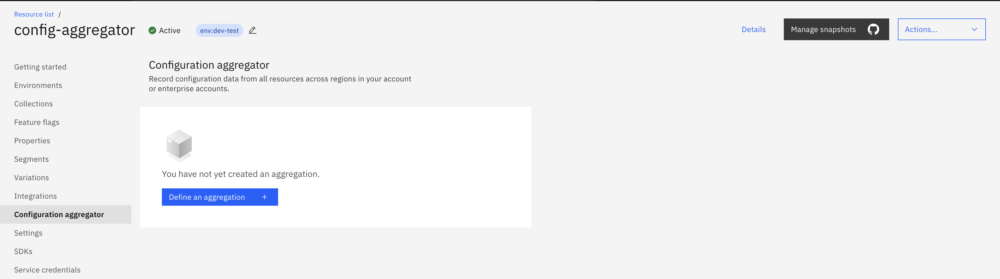
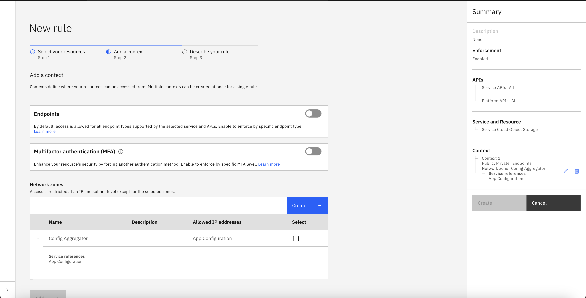
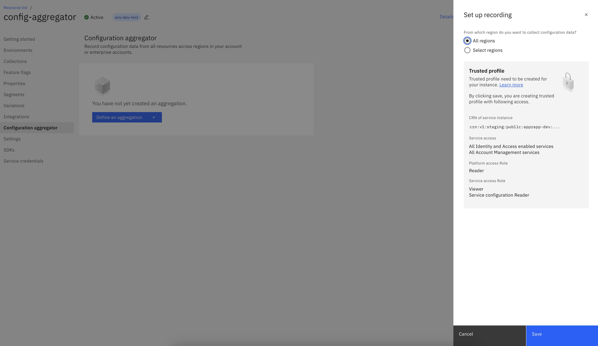
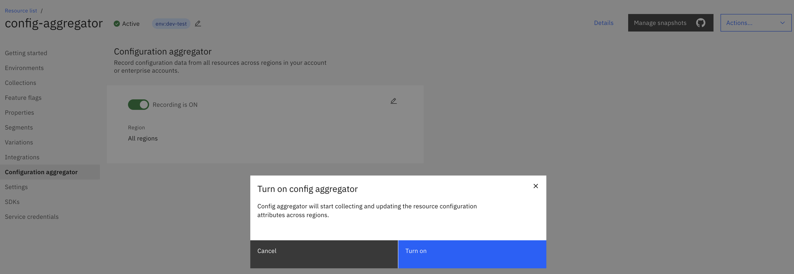
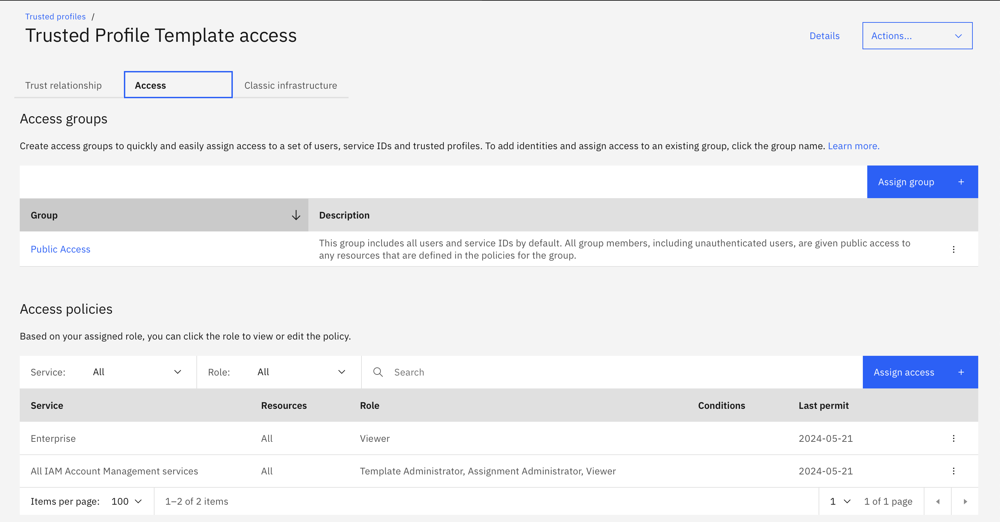
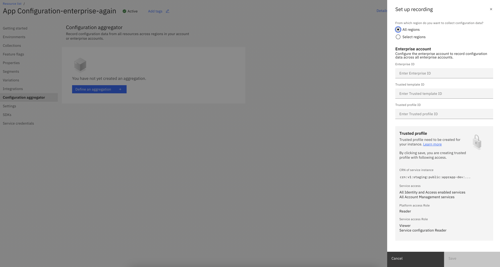
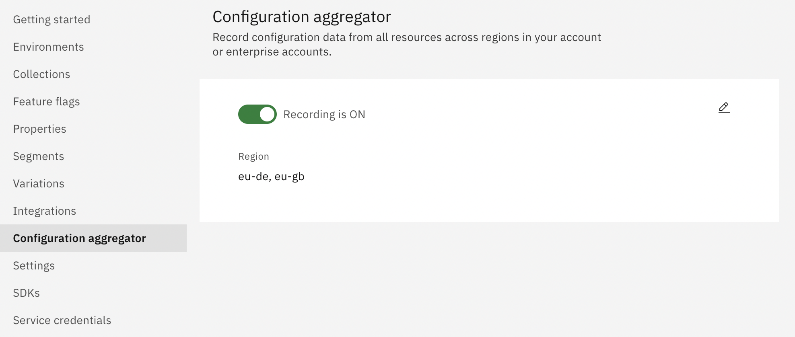

---

copyright:
  years: 2020, 2026
lastupdated: "2026-09-01"

keywords: app-configuration, app configuration, enable configuration aggregation

subcollection: app-configuration

---

{{site.data.keyword.attribute-definition-list}}

# Configuration Aggregator
{: #ac-configuration-aggregator}

Configuration Aggregator can be used to facilitate a Cloud Governance SME with up-to-date configuration data of IBM Cloud resources in one place so that comprehensive information is available for governance and compliance initiatives. All the plans of the {{site.data.keyword.appconfig_short}} service except the Lite plan will have the Configuration Aggregator feature available. As an app owner, the user has to explicitly enable the Configuration Aggregator. It can be done on the {{site.data.keyword.appconfig_short}} instance either via API, SDK, or console. The {{site.data.keyword.appconfig_short}} service will start the resource collection and periodically reconcile to keep the metadata current. Users can use the query API to get the updated metadata of the service instances in the account.

Configuration Aggregator feature can be configured on an {{site.data.keyword.appconfig_short}} instance at Enterprise account level to collect resource metadata from all the sub-accounts of the enterprise. A trusted profile template should be created providing access to {{site.data.keyword.appconfig_short}} service instance to all the IAM enabled services. The trusted profile template should then be assigned to the required accounts in the Enterprise, which in turn creates the trusted profile in the respective sub-accounts providing access to App Configuration service instance to collect resource metadata.

By default, recording is always set to be OFF.

## Resource configuration collection
{: #ac-configuration-data-collection-methods}

Configuration Aggregator uses two methods to collect and maintain up-to-date resource configuration:
{: shortdesc}

- **Scheduled reconciliation** - Periodic collection of resource configuration at scheduled intervals to ensure the configuration database remains current. Manual reconciliation (on-demand refresh outside the scheduled interval) is available only on the Enterprise plan.
- **Near real-time configuration collection** - Event-driven collection triggered by configuration changes detected through Activity Tracker events, enabling faster detection and remediation of security and compliance issues. Near real-time resource collection is available only on the Standard and Enterprise plans.

For more information about enabling near real-time resource collection, see [Near real-time configuration updates](/docs/app-configuration?topic=app-configuration-ac-near-realtime-updates).

{: caption="Default Configuration Aggregator" caption-side="bottom"}

## Configuration aggregator used with Security and Compliance Center Workload Protection
{: #ac-configuration-aggregator-with-workload-protection}

The Configuration aggregator is the data source used by Security and Compliance Center Workload Protection to perform cloud security posture management (CSPM) of IBM Cloud resources.  When configuring IBM Cloud CSPM within Workload Protection, an instance of App Configuration with aggregation enabled is automatically connected to Workload Protection.  You do need to explicitly enable recording as mentioned above.  New instances of App Configuration created through workload protection are provisioned into the Basic Plan by default.  Aggregation within the Basic plan is free and will not add to the cost of Workload Protection.

When Context Based Restrictions are enabled for any resource in your IBM Cloud account, configuration cannot be collected unless access to that resource is provided. To provide access, you need to create a rule. When asked to add a context, create a network zone and select App Configuration as the reference service. 
   {: caption="CBR for Configuration Aggregator" caption-side="bottom"}
{: note}

## Enable Configuration aggregator - Single Account
{: #ac-enable-configuration-aggregator-single-account}

To enable configuration aggregator, complete these steps:

1. In the {{site.data.keyword.appconfig_short}} console, click **Configuration aggregator**.

1. Click **Define an aggregation**. The side panel opens with fields for setting up recording details.

{: caption="Set up recording - Single Account" caption-side="bottom"}

1. Select either **all regions** or specific regions from the **region** list. Click **Save** to complete. This will create a Trusted Profile on the {{site.data.keyword.appconfig_short}} instance with reader access for reading the configurations of the resources.

1. Click the toggle button to enable recording. A confirmation prompt will appear. Click **Turn on**.

{: caption="Enable Recording - Single Account" caption-side="bottom"}

## Enable Configuration aggregator - Enterprise Account
{: #ac-enable-configuration-aggregator-enterprise-account}

**To enable the Configuration Aggregator feature for an enterprise account, users must complete the following prerequisites**:

1. Create an {{site.data.keyword.appconfig_short}} instance at the top-level of the enterprise, i.e., the enterprise account.

1. Create a Trusted Profile Template providing access for the {{site.data.keyword.appconfig_short}} service instance to the IAM enabled services and Account Management services. Refer to [Creating Trusted Profile](/docs/enterprise-management?topic=enterprise-management-tp-template-create)

{: caption="Trusted Profile Template - Enterprise Account" caption-side="bottom"}

The trusted profile template cannot be assigned to the enterprise account, i.e., the top level account of the enterprise. If you choose to collect metadata of resources in the enterprise account, you should create a separate trusted profile that should be applied at the top level account additionally.
{: note}

1. Assign the Trusted profile template to the required accounts and account groups in the Enterprise.

The Enterprise IAM should be enabled in the sub-accounts of an Enterprise to be managed via Enterprise. For more details, refer to [Opting in to enterprise-managed IAM](/docs/enterprise-management?topic=enterprise-management-enterprise-managed-opt-in)
{: note}

To enable configuration aggregator for an enterprise account, complete the pre-requisites and following steps:

1. In the {{site.data.keyword.appconfig_short}} console, click **Configuration aggregator**.

1. Click **Define an aggregation**. The side panel opens with fields for setting up recording details.

{: caption="Set up recording - Enterprise Account" caption-side="bottom"}

1. Provide the details required to set up recording:
   - **Region** - regions from which the user wants to collect configuration data.
   - **Enterprise ID** - enterprise account id.
   - **Trusted template ID** - trusted profile template id created as pre-requisite.
   - **Trusted profile ID** - trusted profile id created as pre-requisite.

1. Click **Save**.

1. Click the toggle button to enable recording. A confirmation prompt will appear. Click **Turn on**.

   {: caption="Enable Recording - Enterprise Account" caption-side="bottom"}

## Billing and metering for Configuration Aggregator
{: #ac-configuration-aggregator-billing}

When you enable Configuration Aggregator on a Standard or Enterprise plan {{site.data.keyword.appconfig_short}} instance, usage is measured and billed against two metrics.

| Metric | What is measured |
| --- | --- |
| **Config items** | The total number of IBM Cloud resource configurations stored in the aggregator for your account. Each unique resource configuration record counts as one config item. |
| **Accounts reconciled** | The number of accounts whose resource configurations are actively reconciled by the aggregator. For stand-alone accounts this is always 1. For enterprise instances it is 1 (the parent account) plus the number of active sub-accounts included in the collection. |
{: caption="Configuration Aggregator billing metrics" caption-side="bottom"}

### Accounts reconciled billing
{: #ac-configuration-aggregator-billing-accounts-reconciled}

For each billing period, the **maximum** number of accounts reconciled across all runs in that period is used as the billed quantity. This means:

- Adding a sub-account mid-period increases the count from the next billing run onward.
- Removing a sub-account mid-period does not reduce the billed quantity for that period.

### Plan changes
{: #ac-configuration-aggregator-billing-plan-changes}

If your {{site.data.keyword.appconfig_short}} plan changes during a billing period, usage is tracked independently for each plan. Each plan's usage is submitted to billing separately.

### Enterprise accounts
{: #ac-configuration-aggregator-billing-enterprise}

For enterprise instances, all active sub-accounts included in the collection are counted toward the **accounts reconciled** metric. Config items from all sub-accounts are aggregated and counted toward the **config items** metric for the parent instance.

### Viewing your usage
{: #ac-configuration-aggregator-billing-view-usage}

You can view Config Aggregator usage metrics on the {{site.data.keyword.cloud_notm}} [Billing and Usage dashboard](https://cloud.ibm.com/billing/usage){: external}.

## Retrieve Resource Metadata
{: #ac-enable-configuration-aggregator-query-configs}

You can query for the configurations of IBM Cloud resources using the list API. It provides detailed metadata of the resources when Configuration Aggregator is enabled for an {{site.data.keyword.appconfig_short}} instance.

## List of Services Supported by Configuration Aggregator
{: #ac-list-of-services-configaggregator}

Configuration Aggregator supports the following services:

| Name of service |
|-----------------|
| [Cloud Object Storage](/docs/cloud-object-storage) |
| [Kubernetes Service](/docs/containers) |
| [Red Hat OpenShift](/docs/openshift) |
| [Virtual server for VPC](/docs/vpc?topic=vpc-creating-virtual-servers) |
| [Virtual Private Cloud](/docs/vpc) |
| [Block storage volume for VPC](/docs/vpc?topic=vpc-creating-block-storage) |
| [Block storage snapshots for VPC](/docs/vpc?topic=vpc-snapshots-vpc-create) |
| [Secrets Manager](/docs/secrets-manager) |
| [Databases for PostgreSQL](/docs/databases-for-postgresql) |
| [Databases for Redis](/docs/databases-for-redis) |
| [Databases for ElasticSearch](/docs/databases-for-elasticsearch) |
| [Databases for MongoDB](/docs/databases-for-mongodb) |
| [Databases for MySQL](/docs/databases-for-mysql) |
| [Identity and Access Management (IAM)](/docs/iam?topic=iam-cloudaccess) |
| [Key Protect](/docs/key-protect) |
| [Container Registry](/docs/Registry?topic=Registry-getting-started) |
| [Load Balancer for VPC](/docs/loadbalancer-service) |
| [Security Group for VPC](/docs/vpc?topic=vpc-using-security-groups) |
| [SSH Keys for VPC](/docs/vpc?topic=vpc-ssh-keys) |
| [Subnet for VPC](/docs/vpc?topic=vpc-about-subnets-vpc) |
| [Virtual Private Endpoint (VPE) for VPC](/docs/vpc?topic=vpc-ordering-endpoint-gateway&interface=ui) |
| [Auto Scale (Instance Group) for VPC](/docs/vpc?topic=vpc-creating-auto-scale-instance-group) |
| [Bare Metal servers for VPC](/docs/vpc?topic=vpc-planning-for-bare-metal-servers) |
| [Client VPN for VPC](/docs/vpc?topic=vpc-vpn-client-to-site-overview) |
| [Dedicated Host for VPC](/docs/vpc?topic=vpc-creating-dedicated-hosts-instances) |
| [Floating IP for VPC](/docs/vpc?topic=vpc-fip-about) |
| [Flow Logs - VPC](/docs/vpc?topic=vpc-flow-logs) |
| [Custom image for VPC](/docs/vpc?topic=vpc-planning-custom-images) |
| [Placement Groups for VPC](/docs/vpc?topic=vpc-about-placement-groups-for-vpc) |
| [Code Engine](/docs/codeengine) |
| [Network ACL - VPC](/docs/vpc?topic=vpc-using-acls) |
| [DNS Service - VPC](/docs/dns-svcs) |
| [VPN for VPC](/docs/vpc?topic=vpc-about-networking-for-vpc#external-connectivity) |
| [IBM Cloud Backup - VPC](/docs/vpc?topic=vpc-backup-service-about) |
| [Public Gateway](/docs/vpc?topic=vpc-about-public-gateways) |
| [Event Streams (messagehub)](/docs/EventStreams) |
| [IBM Cloud Direct Link](/docs/dl) |
| [Transit Gateway](/docs/transit-gateway) |
| [Toolchain](/docs/ContinuousDelivery) |
| [IBM Cloudant](/docs/Cloudant) |
| [IBM Cloud Internet Services (CIS)](/docs/cis) |
| [IBM Cloud Logs](/docs/cloud-logs) |
| [IBM Cloud Shell](/docs/cloud-shell?topic=cloud-shell-getting-started) |
| [IBM Cloud Monitoring](/docs/monitoring?topic=monitoring-getting-started#getting-started) |
| [Security and Compliance Center (SCC)](/docs/security-compliance) |
| [SCC Workload Protection](/docs/workload-protection?topic=workload-protection-getting-started) |
| [Hyper Protect Crypto Services (HPCS)](/docs/hs-crypto) |
| [App ID](/docs/appid) |
| [App Configuration](/docs/app-configuration) |
| [Catalog Management](/docs/account?topic=account-restrict-by-user&interface=ui) |
| [Event Notifications](/docs/event-notifications) |
| [Messages for RabbitMQ](/docs/messages-for-rabbitmq) |
| [IBM Cloud Projects](/docs/secure-enterprise?topic=secure-enterprise-understanding-projects) |
| [IBM Cloud Activity Tracker Event Routing](/docs/atracker) |
| [Enterprise](/docs/enterprise-management) |
| [IBM Power Virtual Server](/docs/power-iaas) |
| [Power Virtual Server networks](/docs/power-iaas) |
| [Power Virtual Server network address groups](/docs/power-iaas) |
| [Power Virtual Server network security groups](/docs/power-iaas) |
| [Power Virtual Server instances](/docs/power-iaas) |
| [Power Virtual Server volumes](/docs/power-iaas) |
| [Virtual Network Interfaces for VPC](/docs/vpc?group=virtual-network-interfaces) |
| [IBM Cloud Schematics](/docs/schematics) |
| [Billing](/docs/account?topic=account-billing-overview) |
| [Global catalog collections](/docs/account?topic=account-restrict-by-user&interface=ui) |
| [IAM Access Management](/docs/iam?topic=iam-cloudaccess) |
| [IAM groups](/docs/account?topic=account-account-services&interface=ui) |
| [IAM identity](/docs/iam?topic=iam-identities) |
| [User management](/docs/account?topic=account-iamuserinv) |
| [watsonx.ai Runtime](https://dataplatform.cloud.ibm.com/docs/content/wsj/analyze-data/ml-overview.html?context=cpdaas) |
{: caption="List of services supported by Configuration Aggregator" caption-side="bottom"}

Databases for EnterpriseDB (EDB) and Databases for etcd are deprecated and are no longer supported by Configuration Aggregator.
{: note}

Effective 20 March 2026, Hyper Protect Crypto Services will be deprecated. You will not be able to create any new instances starting 28 March 2026. All instances will be terminated by 20 March 2027.
{: note}
