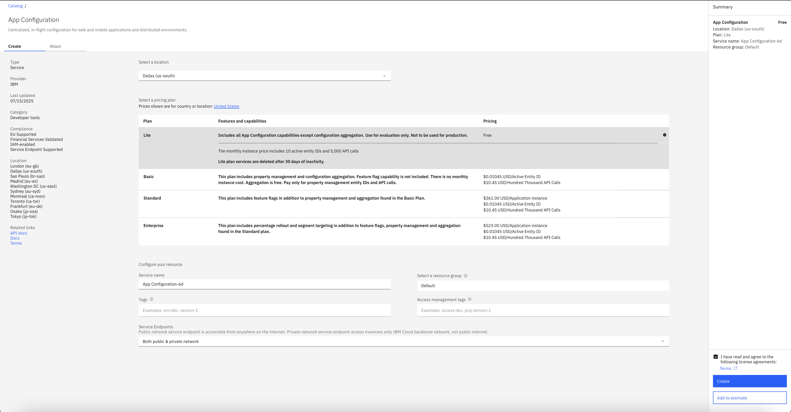
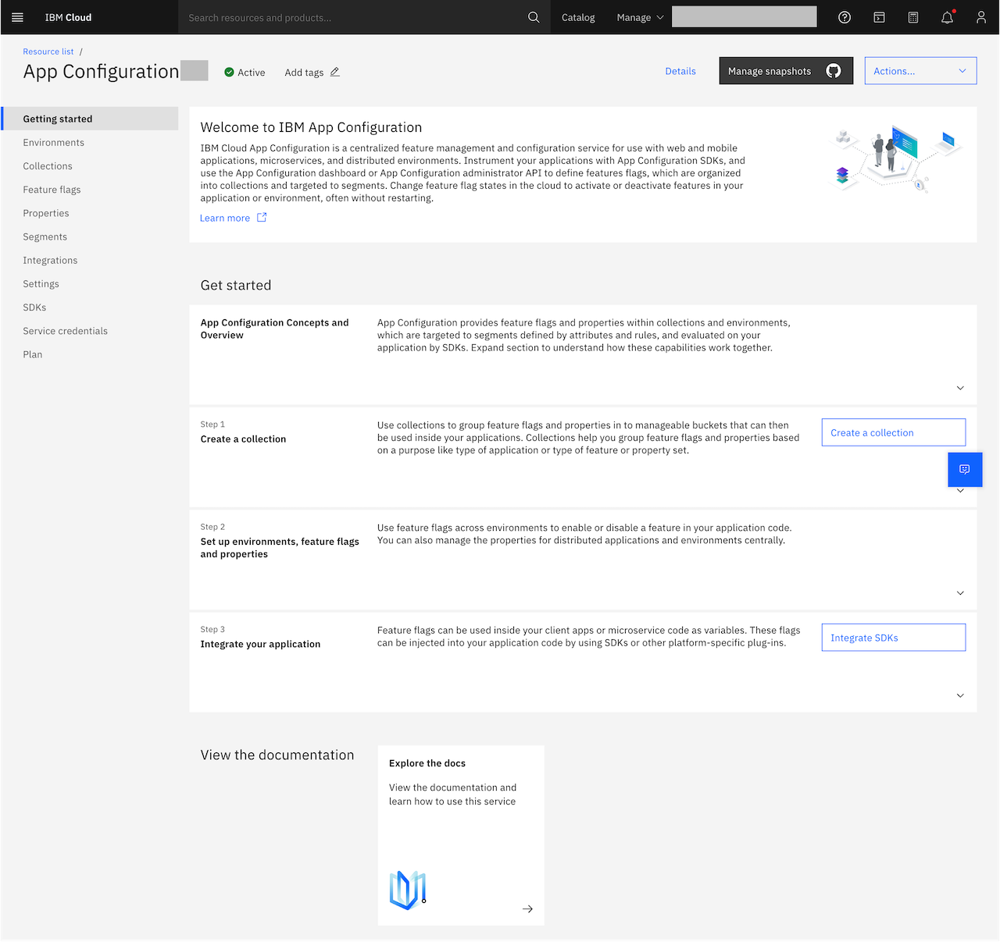

---

copyright:
  years: 2020, 2025
lastupdated: "2025-04-30"

keywords: app-configuration, app configuration, create an instance

subcollection: app-configuration

---

{{site.data.keyword.attribute-definition-list}}

# Creating an {{site.data.keyword.appconfig_short}} service instance
{: #ac-create-an-instance}

{{site.data.keyword.appconfig_short}} provides capabilities to deliver an agile development methodology by separating feature rollouts from regular release cycles. {{site.data.keyword.appconfig_short}} is a centralized feature management and configuration service for use with web and mobile applications, microservices, and distributed environments.
{: shortdesc}

Instrument your applications with {{site.data.keyword.appconfig_short}} SDKs, and use the {{site.data.keyword.appconfig_short}} dashboard or {{site.data.keyword.appconfig_short}} administrator API to define features flags, which are organized into collections and targeted to segments. Change feature flag states in the cloud to activate or deactivate features in your application or environment, often without restarting.

You need an {{site.data.keyword.cloud}} account to create an instance of the {{site.data.keyword.appconfig_short}} service.
{: note}

To create an {{site.data.keyword.appconfig_short}} service instance, follow these steps.

1. Log in to your {{site.data.keyword.cloud_notm}} account.

1. In the [{{site.data.keyword.cloud_notm}} catalog](https://cloud.ibm.com/catalog#services){: external}, search **{{site.data.keyword.appconfig_short}}** and select [{{site.data.keyword.appconfig_short}}](https://cloud.ibm.com/catalog/services/apprapp){: external}. The service configuration screen opens.

   {: caption="{{site.data.keyword.appconfig_short}} service instance" caption-side="bottom"}

1. In the **Create** tab, select the location that represents the geographic area (**Region**) where you want to provision your instance. Currently, Dallas (us-south), Washington DC (us-east), London (eu-gb), Frankfurt (eu-de), Madrid (eu-es), Tokyo (jp-tok), Osaka (jp-osa), Toronto(ca-tor), Sydney (au-syd) and Sao Paulo (br-sao) regions are supported.

1. **Select a pricing plan** - Based on your business requirements, select a pricing plan: Lite, Basic, Standard, and Enterprise.

   - `Lite` - Includes all {{site.data.keyword.appconfig_short}} capabilities for evaluation only. Not to be used for production. Lite plan services are deleted after 30 days of inactivity.

   - `Basic` - The Basic plan includes support for property management capabilities only. There is no monthly instance cost. Pay only for what you use.

   - `Standard` - The standard plan includes feature flags and property management capabilities. You can use simple and uniform REST APIs to configure, enable, segment, and monitor features to mobile devices and web applications.

   - `Enterprise` - The enterprise plan includes targeting segment in addition to the property management and feature flags that are found in the Standard plan. The enterprise plan now supports by using private endpoints.

   For more information about {{site.data.keyword.appconfig_short}} usage and billing, see [Usage and billing](/docs/app-configuration?topic=app-configuration-ac-faqs-usage).
   {: note}

1. Configure your resource by providing a **Service name** for your instance, or use the preset name.

1. **Select a resource group** - The resource group selection helps how you want resources to be organized in your account. The resource group that you select cannot be changed after the service instance is created.

1. Optionally, define **Tags** to help you to identify and organize the instance in your account. If your tags are billing related, consider writing tags as *key:value* pairs to help group-related tags, such as `costctr:124`.

1. Optionally, define **Access management tags** that are needed to apply flexible access policies on specific resources. For example, `access:dev, proj:version-1`.

1. If you selected the Enterprise plan, then specify the **Service endpoints**. The following options are available:
   - *Public network* - The public network service endpoints are accessible from anywhere on the internet.
   - *Both Public & Private network* - use of both public and private service endpoint network access.

1. Accept the licensing agreements and terms by clicking the checkbox.

1. Click **Create**. A new service instance is created and the {{site.data.keyword.appconfig_short}} console displayed.

   {: caption="{{site.data.keyword.appconfig_short}} console" caption-side="bottom"}
