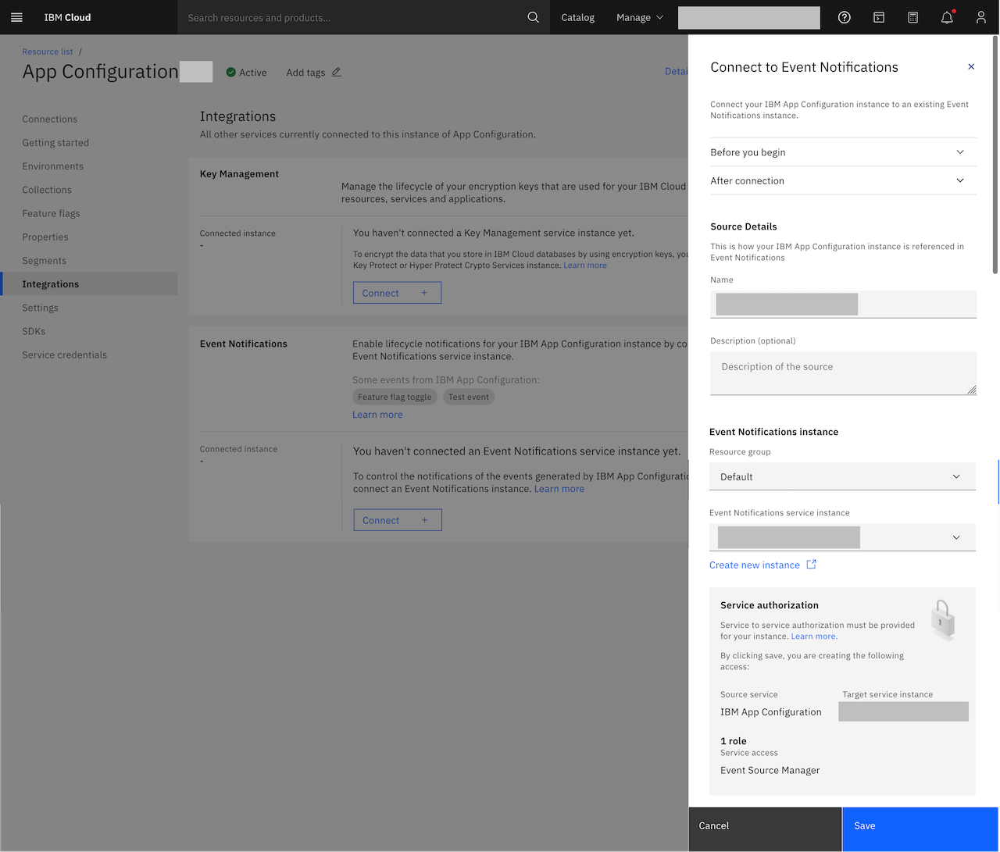

---

copyright:
  years: 2023, 2024
lastupdated: "2024-10-09"

keywords: app-configuration, app configuration, ac, integrations, event notifications, en

subcollection: app-configuration

---

{{site.data.keyword.attribute-definition-list}}

# Integrating with {{site.data.keyword.en_short}}
{: #ac-int-en}

As an administrator of {{site.data.keyword.appconfig_short}}, you might want to send notifications of events in {{site.data.keyword.appconfig_short}} to other users, or human destinations, by using email, SMS, or other supported delivery channels. Additionally, you might want to send these notifications of events to other applications to build logic by using event-driven programming that uses webhooks, for example. This is made possible by the integration between {{site.data.keyword.appconfig_short}} and {{site.data.keyword.en_short}}.
{: shortdesc}

To send information to {{site.data.keyword.en_short}}, you must connect your {{site.data.keyword.appconfig_short}} service instance to {{site.data.keyword.en_short}}. For more information about working with {{site.data.keyword.en_short}}, see [Getting started with {{site.data.keyword.en_short}}](https://{DomainName}/docs/event-notifications).

## How events are collected and sent by {{site.data.keyword.appconfig_short}}?
{: #ac-events-collected-and-sent-en}

When an event of interest takes place in your {{site.data.keyword.appconfig_short}} instance, {{site.data.keyword.appconfig_short}} communicates with a connected {{site.data.keyword.en_short}} instance to forward a notification to a [supported destination](/docs/event-notifications?topic=event-notifications-supported-destinations).

## Events for {{site.data.keyword.appconfig_short}}
{: #ac-en-int-events}

The following table lists the {{site.data.keyword.appconfig_short}} actions that generate an event.

| Event name | Event type | Subtype | Severity level |
| :--------- | :--------- | :------ | :------------- |
| Test event | `com.ibm.cloud.apprapp.test_event` |   | Low |
| Feature flag toggle | `com.ibm.cloud.apprapp.feature_flag_toggle` | enabled  \n disabled | High |
{: caption="Actions that generate event notifications" caption-side="bottom"}

## Enabling notifications with {{site.data.keyword.en_short}}
{: #ac-int-en-enable-notifications}

Events that are generated by an instance of the {{site.data.keyword.appconfig_short}} service can be forwarded to an {{site.data.keyword.en_short}} service instance that is available in the same account. You can configure only one {{site.data.keyword.appconfig_short}} instance to one {{site.data.keyword.en_short}} service instance. To get started, you need:

- [Manage service access](/docs/app-configuration?topic=app-configuration-ac-service-access-management) on the {{site.data.keyword.appconfig_short}} service.
- [Manage service access](https://{DomainName}/docs/event-notifications?topic=event-notifications-service-access-management) on the {{site.data.keyword.en_short}} service. To view an existing {{site.data.keyword.en_short}} service instance in your account, you also need Viewer platform access or higher.

### Connecting to {{site.data.keyword.en_short}} in the UI
{: #ac-int-en-connecting}

Before you begin integrating {{site.data.keyword.en_short}} with {{site.data.keyword.appconfig_short}}, you need to [create an {{site.data.keyword.en_short}} service](/catalog/services/event-notifications) instance in the same account as your {{site.data.keyword.appconfig_short}} instance. Make sure you have IAM role Manager for {{site.data.keyword.IBM_notm}} {{site.data.keyword.appconfig_short}}, and [IAM service-to-service authorization](#ac-using-auth-access-between-services1).
{: note}

If you are using {{site.data.keyword.appconfig_short}} CLI or API to create integration with a {{site.data.keyword.en_short}} service instance, ensure that you have enabled authorization to grant access between services before integrating with {{site.data.keyword.en_short}}. For more information, see [Using authorizations to grant access between services](#ac-using-auth-access-between-services1).
{: important}

To integrate with a {{site.data.keyword.en_short}} service, perform the following steps:

1. From your {{site.data.keyword.appconfig_short}} service instance dashboard, click **Integrations**. By default, the integrations display the services that are supported along with integrations in the current {{site.data.keyword.appconfig_short}} service.

1. From **Event Notifications** tile, click **Connect +**. This displays the **Connect to {{site.data.keyword.en_short}}** side panel.

   {: caption="Create {{site.data.keyword.en_short}} integration" caption-side="bottom"}

1. Enter the **Source Details**. The source details provided will be referenced in {{site.data.keyword.en_short}}.
   - **Name** - Enter the name for your {{site.data.keyword.appconfig_short}} instance to be referenced in {{site.data.keyword.en_short}}.
   - **Description** - Optionally, provide a short description about this source.

1. Provide the following **{{site.data.keyword.en_short}} instance** details, if you already have an {{site.data.keyword.en_short}} instance. Otherwise, click the **Create new instance**.
   - **Resource Group** - Select the resource group where your {{site.data.keyword.en_short}} instance is created from the list.
   - **{{site.data.keyword.en_short}} service instance** - Select the {{site.data.keyword.en_short}} service instance from the list.

1. Click **Save** to apply the integration.

   An error is displayed if no IAM service-to-service authorization enabled, and the integration details will not be saved.
   {: note}

The integrated **{{site.data.keyword.en_short}}** details are listed under **Connected instance**.

The overflow menu of the **Connected instance** consists of:
- **Refresh** - Select this option to refresh the details of {{site.data.keyword.en_short}} instance integration.
- **Disconnect** - Select this option to disconnect the {{site.data.keyword.en_short}} instance integrated earlier with your {{site.data.keyword.appconfig_short}} service instance.

After successful integration, you need to create Topics, Destinations, and Subscriptions in {{site.data.keyword.en_short}} to be notified of events that are generated by your {{site.data.keyword.appconfig_short}} service instance. For more details, see [Event Notifications documentation](/docs/event-notifications?topic=event-notifications-getting-started).

When you create a Topic in your {{site.data.keyword.en_short}} service instance, do these steps:
- Select the **Source** as *App Configuration*.
- Select the **Event type** based on your requirement. For more information, see [event type](#ac-en-int-events).
- Select the **Event subtype**, which is optional.
- Select the **Severity**, which is optional.
- Define the **Advanced conditions**, which is optional.

## Using authorizations to grant access between services
{: #ac-using-auth-access-between-services1}

Use {{site.data.keyword.cloud}} Identity and Access Management (IAM) to create or remove an authorization that grants one service access to another service. Use authorization delegation to automatically create access policies that grant access to dependent services.

### Creating an authorization in the console
{: #ac-create-auth-console1}

1. In the {{site.data.keyword.cloud_notm}} console, click **Manage** > **Access (IAM)**, and select **Authorizations**.

1. Click **Create**.

1. Select a source account.
   * If the source service that needs access to the target service is in this account, select **This account**.
   * If the source service that needs access to the target service is in a different account, select **Other account**. Then, enter the **Account ID** of the source account.

1. Select a **Source service** as **App Configuration**.

1. Specify whether you want the authorization to be for all resources or Resources based on selected attributes. If you selected Resources based on selected attributes, then specify the **Add attributes**: only source resource group or only source service instance.

1. Select a **Target service** as **Event Notifications**.

1. For the target service, specify whether you want the authorization to be for all instances, only to a specific instance in the account, or instances only in a certain resource group.

1. Select a role to assign access to the source service that accesses the target service.

1. Click **Authorize**.

### Creating an authorization by using the CLI
{: #ac-create-auth-cli1}

To authorize a source service to access a target service, run the `ibmcloud iam authorization-policy-create` command.

For more information about all of the parameters that are available for this command, see [ibmcloud iam authorization-policy-create](/docs/cli?topic=cli-ibmcloud_commands_iam#ibmcloud_iam_authorization_policy_create).

## Notification payload details
{: #ac-int-en-notifications-payload}

Successful events that are generated by {{site.data.keyword.appconfig_short}} contain various fields that help you to identify the source and details of the event.


```json
{
    "subject": "flight-booking",
    "type": "com.ibm.cloud.apprapp.feature_flag_toggle:disabled",
    "severity": "HIGH",
    "datacontenttype": "application/json",
    "data": {
        "environment_id": "staging",
        "name": "Flight Booking",
        "feature_id": "flight-booking",
        "description": "Feature flag to enable flight booking in blue charge application",
        "tags": "uat, v1",
        "type": "BOOLEAN",
        "enabled_value": true,
        "disabled_value": false,
        "segment_rules": [],
        "rollout_percentage": 100,
        "enabled": false,
        "collections": [
            {
                "collection_id": "blue-charge",
                "name": "Blue charge"
            }
        ],
        "created_time": "2024-02-10T20:06:45Z",
        "updated_time": "2024-02-12T13:43:12Z",
        "href": "http://us-south.apprapp.cloud.ibm.com/apprapp/feature/v1/instances/473de1e9-3ec0-47a4-9e44-a1508b4a09ec/environments/staging/features/flight-booking"
    },
    "ibmendefaultshort": "Your feature flag was disabled successfully",
    "ibmendefaultlong": "The following feature flag was disabled in your App Configuration instance: flight-booking",
    "ibmensmstext": "Your feature flag was disabled successfully",
    "ibmensubject": "Your feature flag was disabled successfully",
    "ibmenhtmlbody": "Hello,<br/><br/>The following feature flag was disabled in your App Configuration instance: flight-booking<br/><br/>You can view and manage your feature flags & properties by accessing <a href=https://cloud.ibm.com/services/apprapp/crn%3Av1%3Abluemix%3Apublic%3Aapprapp%3Aus-south%3Aa%2Fdc420e985bb849d6b8352f71dac26ab8%3A473de1e9-3ec0-47a4-9e44-a1508b4a09ec%3A%3A>App Configuration</a> in the console, or by using the CLI or APIs. For more information, check out the <a href=https://cloud.ibm.com/docs/app-configuration>docs</a>.<br/><br/>",
    "source": "IBM Cloud App Configuration",
    "ibmensourceid": "crn:v1:bluemix:public:apprapp:us-south:a/dc420e985bb849d6b8352f71dac26ab8:473de1e9-3ec0-47a4-9e44-a1508b4a09ec::",
    "id": "e5bf8f16057d4677a0773cce92916d03",
    "specversion": "1.0",
    "time": "2024-04-25T18:27:51Z"
}
```
{: screen}


Review following table for more information about event notification properties.

| Property | Description |
| ---- | ---- |
| `subject` | The subject of the event. It can be the ID of the feature flag being toggled. |
| `type` | Describes the type of event. [See table.](/docs/app-configuration?topic=app-configuration-ac-int-en#ac-en-int-events)|
| `severity` | The level of severity of the event. [See table.](/docs/app-configuration?topic=app-configuration-ac-int-en#ac-en-int-events) |
| `datacontenttype` | The MIME type of the data content. |
| `data` | An object containing the metadata about the event. |
| `ibmendefaultshort` | The default short text of the event. |
| `ibmendefaultlong` | The default long text of the event. |
| `ibmensmstext` | The text that used as the body of the SMS if the event gets routed to a destination of type SMS. |
| `ibmensubject` | The subject text used for emails if the event gets routed to a destination of type SMTP. |
| `ibmenhtmlbody` | The html body of the event. |
| `source` | The source name of event. |
| `ibmensourceid` | The source identifier among multiple source(s) in Event Notifications. |
| `id` | Event identifier. |
| `specversion` | The version of CloudEvents specification that Event Notifications supports. |
| `time` | UTC timestamp of when the event occurred.|
{: caption="Properties in an event notifications payload" caption-side="bottom"}
