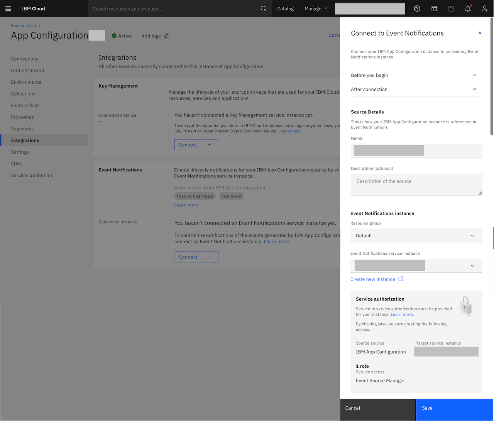

---

copyright:
  years: 2023, 2026
lastupdated: "2026-03-10"

keywords: app-configuration, app configuration, ac, integrations, event notifications, en

subcollection: app-configuration

---

{{site.data.keyword.attribute-definition-list}}

# Integrating with {{site.data.keyword.en_short}}
{: #ac-int-en}

As an administrator of {{site.data.keyword.appconfig_short}}, you might want to send notifications of events in {{site.data.keyword.appconfig_short}} to other users, or human destinations, by using email, SMS, or other supported delivery channels. Additionally, you might want to send these notifications of events to other applications to build logic by using event-driven programming that uses webhooks, for example. This is made possible by the integration between {{site.data.keyword.appconfig_short}} and {{site.data.keyword.en_short}}.
{: shortdesc}

To send information to {{site.data.keyword.en_short}}, you must connect your {{site.data.keyword.appconfig_short}} service instance to {{site.data.keyword.en_short}}. For more information about working with {{site.data.keyword.en_short}}, see [Getting started with {{site.data.keyword.en_short}}](https://{DomainName}/docs/event-notifications).

## How events are collected and sent by {{site.data.keyword.appconfig_short}}?
{: #ac-events-collected-and-sent-en}

When an event of interest takes place in your {{site.data.keyword.appconfig_short}} instance, {{site.data.keyword.appconfig_short}} communicates with a connected {{site.data.keyword.en_short}} instance to forward a notification to a [supported destination](/docs/event-notifications?topic=event-notifications-en-destination).

## Events for {{site.data.keyword.appconfig_short}}
{: #ac-en-int-events}

The following table lists the {{site.data.keyword.appconfig_short}} actions that generate an event.

| Event name | Event type | Subtype |
| :--------- | :--------- | :------ |
| Resource config | `com.ibm.cloud.apprapp.config_aggregator.resource_config` |   |
| Environments | `com.ibm.cloud.apprapp.feature_flags.environments` | create  \n update  \n delete |
| Collections | `com.ibm.cloud.apprapp.feature_flags.collections` | create  \n update  \n delete |
| Features | `com.ibm.cloud.apprapp.feature_flags.features` | create  \n update  \n delete |
| Feature flag toggle | `com.ibm.cloud.apprapp.feature_flag_toggle` | enabled  \n disabled |
| Feature rules | `com.ibm.cloud.apprapp.feature_flags.feature_rules` | create  \n update  \n delete |
| Properties | `com.ibm.cloud.apprapp.feature_flags.properties` | create  \n update  \n delete |
| Segments | `com.ibm.cloud.apprapp.feature_flags.segments` | create  \n update  \n delete |
| Gitconfigs | `com.ibm.cloud.apprapp.feature_flags.gitconfigs` | create  \n update  \n delete |
| Originconfigs | `com.ibm.cloud.apprapp.feature_flags.originconfigs` | update |
| Integrations | `com.ibm.cloud.apprapp.feature_flags.integrations` | connected  \n disconnected |
| Instance import | `com.ibm.cloud.apprapp.feature_flags.instance_import` |   |
| Gitconfig promote | `com.ibm.cloud.apprapp.feature_flags.gitconfig_promote` |   |
| Gitconfig restore | `com.ibm.cloud.apprapp.feature_flags.gitconfig_restore` |   |
{: caption="Actions that generate event notifications" caption-side="bottom"}

## Enabling notifications with {{site.data.keyword.en_short}}
{: #ac-int-en-enable-notifications}

Events that are generated by an instance of the {{site.data.keyword.appconfig_short}} service can be forwarded to an {{site.data.keyword.en_short}} service instance that is available in the same account. You can configure only one {{site.data.keyword.appconfig_short}} instance to one {{site.data.keyword.en_short}} service instance. To get started, you need:

- [Manage service access](/docs/app-configuration?topic=app-configuration-ac-service-access-management) on the {{site.data.keyword.appconfig_short}} service.
- [Manage service access](https://{DomainName}/docs/event-notifications?topic=event-notifications-service-access-management) on the {{site.data.keyword.en_short}} service. To view an existing {{site.data.keyword.en_short}} service instance in your account, you also need Viewer platform access or higher.

### Connecting to {{site.data.keyword.en_short}} in the UI
{: #ac-int-en-connecting}

Before you begin integrating {{site.data.keyword.en_short}} with {{site.data.keyword.appconfig_short}}, you need to [create an {{site.data.keyword.en_short}} service](/catalog/services/event-notifications) instance in the same account as your {{site.data.keyword.appconfig_short}} instance. Make sure you have IAM role Manager for {{site.data.keyword.IBM_notm}} {{site.data.keyword.appconfig_short}}, and [IAM service-to-service authorization](#ac-using-auth-access-between-services1).
{: note}

If you are using {{site.data.keyword.appconfig_short}} CLI or API to create integration with a {{site.data.keyword.en_short}} service instance, ensure that you have enabled authorization to grant access between services before integrating with {{site.data.keyword.en_short}}. For more information, see [Using authorizations to grant access between services](#ac-using-auth-access-between-services1).
{: important}

To integrate with a {{site.data.keyword.en_short}} service, perform the following steps:

1. From your {{site.data.keyword.appconfig_short}} service instance dashboard, click **Integrations**. By default, the integrations display the services that are supported along with integrations in the current {{site.data.keyword.appconfig_short}} service.

1. From **Event Notifications** tile, click **Connect +**. This displays the **Connect to {{site.data.keyword.en_short}}** side panel.

   {: caption="Create {{site.data.keyword.en_short}} integration" caption-side="bottom"}

1. Enter the **Source Details**. The source details provided will be referenced in {{site.data.keyword.en_short}}.
   - **Name** - Enter the name for your {{site.data.keyword.appconfig_short}} instance to be referenced in {{site.data.keyword.en_short}}.
   - **Description** - Optionally, provide a short description about this source.

1. Provide the following **{{site.data.keyword.en_short}} instance** details, if you already have an {{site.data.keyword.en_short}} instance. Otherwise, click the **Create new instance**.
   - **Resource Group** - Select the resource group where your {{site.data.keyword.en_short}} instance is created from the list.
   - **{{site.data.keyword.en_short}} service instance** - Select the {{site.data.keyword.en_short}} service instance from the list.

1. Click **Save** to apply the integration.

   An error is displayed if no IAM service-to-service authorization enabled, and the integration details will not be saved.
   {: note}

The integrated **{{site.data.keyword.en_short}}** details are listed under **Connected instance**.

The overflow menu of the **Connected instance** consists of:
- **Refresh** - Select this option to refresh the details of {{site.data.keyword.en_short}} instance integration.
- **Disconnect** - Select this option to disconnect the {{site.data.keyword.en_short}} instance integrated earlier with your {{site.data.keyword.appconfig_short}} service instance.

After successful integration, you need to create Topics, Destinations, and Subscriptions in {{site.data.keyword.en_short}} to be notified of events that are generated by your {{site.data.keyword.appconfig_short}} service instance. For more details, see [Event Notifications documentation](/docs/event-notifications?topic=event-notifications-getting-started).

When you create a Topic in your {{site.data.keyword.en_short}} service instance, do these steps:
- Select the **Source** as *App Configuration*.
- Select the **Event type** based on your requirement. For more information, see [event type](#ac-en-int-events).
- Select the **Event subtype**, which is optional.
- Select the **Severity**, which is optional.
- Define the **Advanced conditions**, which is optional.

## Using authorizations to grant access between services
{: #ac-using-auth-access-between-services1}

Use {{site.data.keyword.cloud}} Identity and Access Management (IAM) to create or remove an authorization that grants one service access to another service. Use authorization delegation to automatically create access policies that grant access to dependent services.

### Creating an authorization in the console
{: #ac-create-auth-console1}

1. In the {{site.data.keyword.cloud_notm}} console, click **Manage** > **Access (IAM)**, and select **Authorizations**.

1. Click **Create**.

1. Select a source account.
   * If the source service that needs access to the target service is in this account, select **This account**.
   * If the source service that needs access to the target service is in a different account, select **Other account**. Then, enter the **Account ID** of the source account.

1. Select a **Source service** as **App Configuration**.

1. Specify whether you want the authorization to be for all resources or Resources based on selected attributes. If you selected Resources based on selected attributes, then specify the **Add attributes**: only source resource group or only source service instance.

1. Select a **Target service** as **Event Notifications**.

1. For the target service, specify whether you want the authorization to be for all instances, only to a specific instance in the account, or instances only in a certain resource group.

1. Select a role to assign access to the source service that accesses the target service.

1. Click **Authorize**.

### Creating an authorization by using the CLI
{: #ac-create-auth-cli1}

To authorize a source service to access a target service, run the `ibmcloud iam authorization-policy-create` command.

For more information about all of the parameters that are available for this command, see [ibmcloud iam authorization-policy-create](/docs/cli?topic=cli-ibmcloud_commands_iam#ibmcloud_iam_authorization_policy_create).

## Notification payload details
{: #ac-int-en-notifications-payload}

Successful events that are generated by {{site.data.keyword.appconfig_short}} contain various fields that help you to identify the source and details of the event.


```json
{
  "data": {
    "changes": {
      "enabled": {
        "new_value": true,
        "old_value": false
      }
    },
    "metadata": {
      "environment_id": "production",
      "feature_id": "member-only-discount",
      "collections": [
        {
          "collection_id": "blue-charge"
        }
      ]
    }
  },
  "datacontenttype": "application/json",
  "en_source_id": "crn:v1:bluemix:public:apprapp:br-sao:a/dc420e985bb849d6b8352f71dac26ab8:c6d52ad4-adaa-492b-941b-daa9e8d63d3a::",
  "ibmendefaultlong": "The features \"Member only discount\" were updated in your IBM Cloud App Configuration instance.",
  "ibmendefaultshort": "Your features \"Member only discount\" were updated",
  "ibmensourceid": "crn:v1:bluemix:public:apprapp:br-sao:a/dc420e985bb849d6b8352f71dac26ab8:c6d52ad4-adaa-492b-941b-daa9e8d63d3a::",
  "id": "appconfig-txid-fb62ce40175c1b2426b491843d9cbce4",
  "notification_id": "5b5473f5-802d-4562-a859-9d31e7699443",
  "source": "IBM Cloud App Configuration Feature flags",
  "specversion": "1.0",
  "subject": "Member only discount",
  "time": "2026-03-06T05:12:25Z",
  "type": "com.ibm.cloud.apprapp.feature_flags.features:update"
}
```
{: screen}


Review following table for more information about event notification properties.

**Mandatory fields**

| Property | Description |
| ---- | ---- |
| `subject` | The subject of the notification. The subject is the name of the resource such as environment name, feature flag name, collection name, segment name, or gitconfig name. |
| `type` | The type of the event along with an optional subtype. |
| `ibmendefaultshort` | Human-readable short description of the notification. |
| `ibmendefaultlong` | Human-readable long description of the notification. |
| `en_source_id` | Same as `ibmensourceid`. |
| `source` | The source of the notification. This value is always the same. |
| `ibmensourceid` | The source ID. Same as the source ID from the Event Notifications service instance to which the integration is created. |
| `notification_id` | Identifier added by Event Notifications for notification traceability. |
| `id` | Identifier added by App Configuration for notification tracing. |
| `specversion` | Version of the notification payload. |
| `time` | Time at which the notification was created by the App Configuration service. |
{: caption="Mandatory fields in an event notifications payload" caption-side="bottom"}

**Optional Fields**

| Property | Description |
| ---- | ---- |
| `datacontenttype` | The content-type of the data field. |
| `data` | The machine readable content is a json format specifying more details about the notification. It has a fixed format for create, update & delete actions respectively. Refer to [data field examples](#ac-int-en-data-field-examples) for each of the resources. |
{: caption="Optional fields in an event notifications payload" caption-side="bottom"}

## Data field examples
{: #ac-int-en-data-field-examples}

The following sections provide examples of the `data` field structure for different event types and subtypes.

<details>
<summary>Resource config</summary>

Event type: `com.ibm.cloud.apprapp.config_aggregator.resource_config`

```json
{
  "account_id": "4f631ea3b3204b2b878a295604994acf",
  "service_name": "kms",
  "config_type": "key",
  "type_id": "crn:v1:bluemix:public:kms:au-syd:a/4f631ea3b3204b2b878a295604994acf:a3d454ea-38f4-4ae1-92e1-6a4aaac24e14:key:8a429ea2-ae32-4253-8233-a533fb5d4b14",
  "resource_crn": "crn:v1:bluemix:public:kms:au-syd:a/4f631ea3b3204b2b878a295604994acf:a3d454ea-38f4-4ae1-92e1-6a4aaac24e14::",
  "last_config_refresh_time": "2026-02-03T14:18:50Z",
  "apprapp_instance_crn": "crn:v1:bluemix:public:apprapp:br-sao:a/4f631ea3b3204b2b878a295604994acf:73446d14-0098-43af-8450-4b338833d0e7::"
}
```
{: codeblock}

</details>

<details>
<summary>Environments</summary>

Event type: `com.ibm.cloud.apprapp.feature_flags.environments`

**Create**

```json
{
  "name": "Prod",
  "environment_id": "prod",
  "tags": "v1,v2",
  "description": "Production environment of Blue charge application",
  "color_code": "#FDD13A"
}
```
{: codeblock}

**Update**

Metadata fields are always present.

```json
{
  "metadata": {
    "environment_id": "prod"
  },
  "changes": {
    "name": {
      "old_value": "Production",
      "new_value": "Production us-south-1"
    },
    "description": {
      "old_value": "My prod environment",
      "new_value": "us-south-1 prod environment"
    },
    "color_code": {
      "old_value": "#111111",
      "new_value": "#000000"
    },
    "tags": {
      "old_value": "v1,v2",
      "new_value": "1.0"
    }
  }
}
```
{: codeblock}

**Delete**

```json
{
  "environment_id": "prod"
}
```
{: codeblock}

</details>

<details>
<summary>Collections</summary>

Event type: `com.ibm.cloud.apprapp.feature_flags.collections`

**Create**

```json
{
  "name": "Blue charge",
  "collection_id": "blue-charge",
  "description": "Collection for Blue charge application",
  "tags": "v-1"
}
```
{: codeblock}

**Update**

Metadata fields are always present.

```json
{
  "metadata": {
    "collection_id": "blue-charge"
  },
  "changes": {
    "name": {
      "old_value": "Blue charge",
      "new_value": "My blue charge app"
    },
    "description": {
      "old_value": "my old description",
      "new_value": "my new description"
    },
    "tags": {
      "old_value": "v1",
      "new_value": "v2"
    }
  }
}
```
{: codeblock}

**Delete**

```json
{
  "collection_id": "blue-charge"
}
```
{: codeblock}

</details>

<details>
<summary>Features</summary>

Event type: `com.ibm.cloud.apprapp.feature_flags.features`

**Create**

Contains additional attribute `environment_id`. Does not contain attribute `segment_rules`.

```json
{
  "name": "Member only discount",
  "feature_id": "member-only-discount",
  "type": "NUMERIC",
  "enabled_value": 10,
  "disabled_value": 0,
  "enabled": true,
  "rollout_percentage": 100,
  "collections": [
    {
      "collection_id": "blue-charge"
    },
    {
      "collection_id": "web-app"
    }
  ],
  "environment_id": "dev"
}
```
{: codeblock}

**Update**

Metadata fields are always present. Does not contain attribute `segment_rules`.

```json
{
  "metadata": {
    "feature_id": "member-only-discount",
    "environment_id": "prod",
    "collections": [
      {
        "collection_id": "blue-charge"
      },
      {
        "collection_id": "web-app"
      }
    ]
  },
  "changes": {
    "rollout_percentage": {
      "old_value": 88,
      "new_value": 44
    },
    "name": {
      "old_value": "discount",
      "new_value": "member only discount"
    },
    "description": {
      "old_value": "new description",
      "new_value": "old description"
    },
    "enabled_value": {
      "old_value": 10,
      "new_value": 5
    },
    "disabled_value": {
      "old_value": 0,
      "new_value": -1
    },
    "enabled": {
      "old_value": false,
      "new_value": true
    },
    "tags": {
      "old_value": "v1",
      "new_value": "v1,e1"
    }
  }
}
```
{: codeblock}

**Delete**

```json
{
  "feature_id": "member-only-discount"
}
```
{: codeblock}

</details>

<details>
<summary>Feature rules</summary>

Event type: `com.ibm.cloud.apprapp.feature_flags.feature_rules`

**Create**

Contains additional attributes `environment_id`, `feature_id`, and `collections`. Does not contain attribute `rules`.

```json
{
  "rule_name": "Rule 4",
  "rule_id": "rule_4",
  "value": 12,
  "order": 4,
  "rollout_percentage": 100,
  "environment_id": "dev",
  "feature_id": "f1",
  "collections": [
    {
      "collection_id": "blue-charge"
    }
  ]
}
```
{: codeblock}

**Delete**

```json
{
  "environment_id": "prod",
  "feature_id": "member-only-discount",
  "rule_id": "rule_4",
  "collections": [
    {
      "collection_id": "blue-charge"
    }
  ]
}
```
{: codeblock}

</details>

<details>
<summary>Properties</summary>

Event type: `com.ibm.cloud.apprapp.feature_flags.properties`

**Create**

Contains additional attribute `environment_id`. Does not contain attribute `segment_rules`.

```json
{
  "name": "Deployment replicas",
  "property_id": "deployment-replicas",
  "description": "Replicas for springboot server",
  "tags": "v1",
  "type": "NUMERIC",
  "value": 5,
  "collections": [
    {
      "collection_id": "blue-charge"
    },
    {
      "collection_id": "web-app"
    }
  ],
  "environment_id": "prod"
}
```
{: codeblock}

**Update**

Metadata fields are always present. Does not contain attribute `segment_rules`.

```json
{
  "metadata": {
    "environment_id": "prod",
    "property_id": "replicas",
    "collections": [
      {
        "collection_id": "blue-charge"
      },
      {
        "collection_id": "web-app"
      }
    ]
  },
  "changes": {
    "description": {
      "old_value": "old description",
      "new_value": "new description"
    },
    "value": {
      "old_value": 3,
      "new_value": 2
    },
    "name": {
      "old_value": "Replicas",
      "new_value": "Replicas for springboot server"
    },
    "tags": {
      "old_value": "v1",
      "new_value": "version: 1.1, pre-release"
    }
  }
}
```
{: codeblock}

**Delete**

```json
{
  "property_id": "my-hostname-port"
}
```
{: codeblock}

</details>

<details>
<summary>Segments</summary>

Event type: `com.ibm.cloud.apprapp.feature_flags.segments`

Does not contain attribute `rules`.

**Create**

```json
{
  "name": "IBMers",
  "segment_id": "ibmers",
  "description": "List of IBMers",
  "tags": "internal,v1"
}
```
{: codeblock}

**Update**

Does not contain attribute `rules`.

```json
{
  "metadata": {
    "segment_id": "ibmers"
  },
  "changes": {
    "description": {
      "old_value": "List of IBMers",
      "new_value": "IBMers list"
    },
    "tags": {
      "old_value": "v-3",
      "new_value": "in,cn"
    }
  }
}
```
{: codeblock}

**Delete**

```json
{
  "segment_id": "ibmers"
}
```
{: codeblock}

</details>

<details>
<summary>Gitconfigs</summary>

Event type: `com.ibm.cloud.apprapp.feature_flags.gitconfigs`

**Create**

```json
{
  "collection_id": "blue-charge",
  "environment_id": "prod",
  "git_branch": "main",
  "git_config_id": "test",
  "git_config_name": "test",
  "git_file_path": "backup.json",
  "git_url": "git_project_url"
}
```
{: codeblock}

**Update**

```json
{
  "metadata": {
    "collection_id": "blue-charge",
    "environment_id": "prod",
    "git_config_id": "test"
  },
  "changes": {
    "git_file_path": {
      "old_value": "backup.json",
      "new_value": "bcdr-apr-2026.json"
    },
    "git_config_name": {
      "old_value": "new test",
      "new_value": "test"
    }
  }
}
```
{: codeblock}

**Delete**

```json
{
  "git_config_id": "test"
}
```
{: codeblock}

</details>

<details>
<summary>Originconfigs</summary>

Event type: `com.ibm.cloud.apprapp.feature_flags.originconfigs`

**Update**

```json
{
  "changes": {
    "allowed_origins": {
      "old_value": "[https://www.bluecharge.com, https://blog.hubspot.com, http://localhost:3000]",
      "new_value": "[https://www.bluecharge.com, https://blog.hubspot.com, http://localhost:3000, https://feature-rbk-5270.release-builder-kit.nonprod.xyz.com, http://localhost:8013]"
    }
  }
}
```
{: codeblock}

</details>

<details>
<summary>Integrations</summary>

Event type: `com.ibm.cloud.apprapp.feature_flags.integrations`

**Connected and disconnected**

```json
{
  "integration_id": "lckkhp34t",
  "integration_type": "EVENT_NOTIFICATIONS",
  "metadata": "{\"event_notifications_endpoint\": \"https://us-south.event-notifications.cloud.ibm.com\", \"event_notifications_source_id\": \"crn:v1:bluemix:public:apprapp:br-sao:a/dc420e985bb849d6b8352f71dac26ab8:c6d52ad4-adaa-492b-941b-daa9e8d63d3a::\", \"event_notifications_instance_crn\": \"crn:v1:bluemix:public:event-notifications:us-south:a/dc420e985bb849d6b8352f71dac26ab8:eae2796f-510b-4ffd-b534-6de0d2b916a8::\"}"
}
```
{: codeblock}

</details>

<details>
<summary>Gitconfig promote</summary>

Event type: `com.ibm.cloud.apprapp.feature_flags.gitconfig_promote`

```json
{
  "metadata": {
    "collection_id": "blue-charge",
    "environment_id": "prod",
    "git_config_id": "test"
  },
  "changes": {
    "git_commit_id": "897fba998c600c1198a0786a96156",
    "git_commit_message": "custom config data written from App config instance",
    "last_sync_time": "2026-03-04T23:47:16Z"
  }
}
```
{: codeblock}

</details>

<details>
<summary>Gitconfig restore</summary>

Event type: `com.ibm.cloud.apprapp.feature_flags.gitconfig_restore`

Does not contain attribute `changes`.

```json
{
  "metadata": {
    "collection_id": "blue-charge",
    "environment_id": "prod",
    "git_config_id": "test"
  }
}
```
{: codeblock}

</details>
