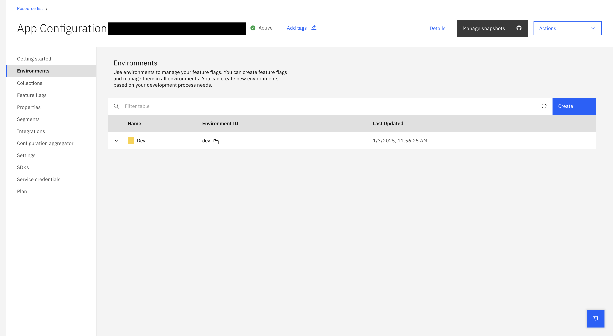
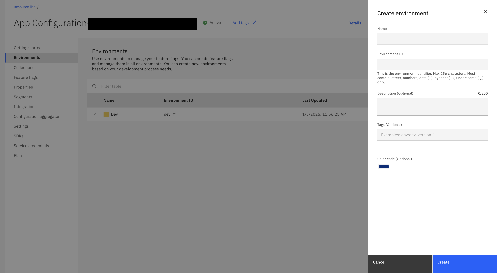
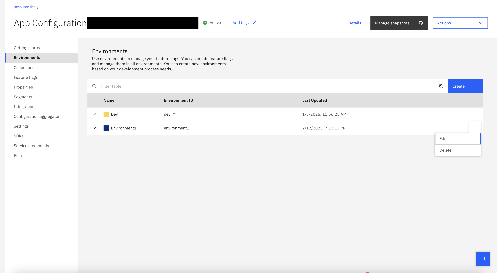

---

copyright:
  years: 2021
lastupdated: "2021-04-18"

keywords: app-configuration, app configuration, environment, environments, create environment

subcollection: app-configuration

---

{:codeblock: .codeblock}
{:external: target="_blank" .external}
{:important: .important}
{:note: .note}
{:pre: .pre}
{:screen: .screen}
{:shortdesc: .shortdesc}
{:tip: .tip}

# Environments
{: #ac-environments}

Environments in {{site.data.keyword.appconfig_short}} represents your application environments. Typical environments could be dev, staging, production and so on. Environments allow to manage your feature flags and properties to various deployments from development to production. Create your environments based on your development requirements.
{: shortdesc}

When you create an {{site.data.keyword.appconfig_short}} instance, an environment is created in the name `dev` by default.  
{: note}

Each feature flag or properties created has its own values, tags and segment rules for each environment.  You can also toggle the feature flag per environment.  This means that you can have different rules for flags per environment for the same feature flag or properties.  

By default, the environemnt pane displays the list of environments that are created in the current {{site.data.keyword.appconfig_short}} service instance along with **Name**, **Environment ID**, **Color code** (hexadecimal color value), date of creation, **Last evaluated**, **segments** that are targeted for the respective property.

{: caption="Figure 3. List of environments" caption-side="bottom"}

## Create an environment
{: #ac-create-environment}

To create an environment, complete these steps:

1. In the {{site.data.keyword.appconfig_short}} console, click **Environments**.
1. Click **Create**. The side-panel opens with fields for creating a new environment.

   {: caption="Figure 4. Creating a new environment" caption-side="bottom"}

1. Provide the environment details:
   - **Name** - name of the environment.
   - **Environment ID** - the environment ID value is auto suggested based on the entered environment name. You can modify the same, if needed. Use the **Environment ID** value as the identifier in your SDK or API code.
   - **Description** - add a description of the environment, which is optional.
   - Optionally, define **Tags** that are required to identify with the environment.
   - Click the color image to change the **Color code** for this environment, which is optional.
1. Click **Create**.

## Environments - overflow menu
{: #environments-overflow-menu}

The overflow menu for each of the environment (three vertical dots) consists of **Edit** and **Delete** operations.

{: caption="Figure 5. Overflow menu for an environment" caption-side="bottom"}

* When **Edit** option is selected, you can make changes to the **Name**, **Description**, add or delete **Tags**, and modify the **Color code**.
* When **Delete** option is selected, a confirmation window is displayed to seek confirmation to delete the selected environment.

By default, at least one environment must be present in an {{site.data.keyword.appconfig_short}} service instance.
{: note}
