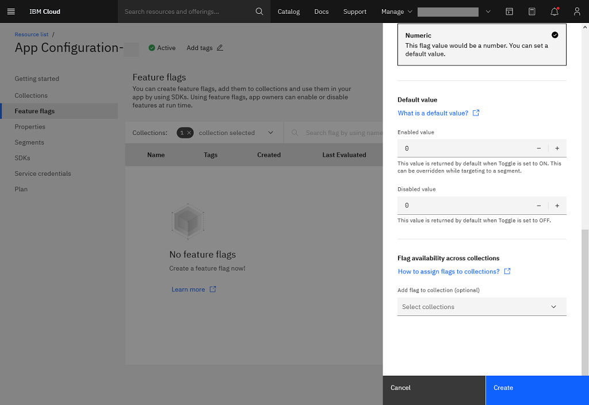

---

copyright:
  years: 2020, 2022
lastupdated: "2022-04-26"

keywords: app-configuration, app configuration, create a feature flag, feature flags

subcollection: app-configuration

---

{{site.data.keyword.attribute-definition-list}}

# Feature flags
{: #ac-feature-flags}

As an app owner, create, and manage feature flags, add them to collections and use them in your app by using SDKs. You can also control the applicability of a feature by enabling or disabling it at run time.
{: shortdesc}

A feature can be enabled or disabled to all the collection users, or to a specific set of users and devices.

By default, the Feature flags pane displays the list of feature flags that are created in the current environment of the {{site.data.keyword.appconfig_short}} service instance along with details of the record. Flag types are categorized as Boolean, Numeric or String.

- A **Boolean** flag has two values and you can set the default value as 'true' or 'false'.
- A **String** type flag supports data in the form of text, and JSON or YAML files.
- A **Numeric** flag supports integers.

{: caption="Figure 9. List of feature flags" caption-side="bottom"}

## Create a feature flag
{: #ac-create-feature-flag}

To create a feature flag, complete these steps:

1. In the {{site.data.keyword.appconfig_short}} console, click **Features flags**.
1. Select the **Current Environment** to display the list of feature flags in that environment.
1. Click **Create**. The side panel opens with fields for creating a new feature flag.

   {: caption="Figure 10. Creating a new feature flag" caption-side="bottom"}

   {: caption="Figure 11. Creating a feature flag further details" caption-side="bottom"}

1. Provide the feature flag details:
   - **Name** - name of the feature flag.
   - **Feature flag ID** - the feature flag ID value is auto suggested based on the entered feature name. You can modify the same, if needed. Use the **Feature flag ID** value as the identifier in your SDK or API code.
   - Optionally, define **Tags** that are required to identify with the feature flag.
   - **Description** - add a description of the feature flag, which is optional.
   - **Flag type** - specify the type of the feature flag. Supported type includes: Boolean, String, and Numeric. For more information about flag type and default values, see [Selecting feature flag type](#selecting-feature-flag-type).
   - **Default value** - specify the default value for the feature flag type selected. For more information about flag type and default values, see [Selecting feature flag type](#selecting-feature-flag-type).
   - Optionally, you can add the feature flag to one or more collections by selecting in the **Flag availability across collections** list.
1. Click **Create**.

By default, when you create a new feature flag, the **Enabled** toggle switch is set to OFF.
{: note}

## Selecting feature flag type
{: #selecting-feature-flag-type}

You can have one of the following flag types that is associated to a feature flag:
- Boolean
- String
- Numeric

Each of the Flag type is having a default value.
{: #flag-type-default-value}

- When you set the toggle switch to *ON*, the value for the **Enabled value** is required, which can be overridden when targeting to a segment.
- When you set the toggle switch to *OFF*, the value for the **Disabled value** is required, which can be overridden when targeting to a segment.

### Boolean
{: #feature-flag-type-boolean}

When you select the **Flag type** as *Boolean*, the **Default value** details are displayed:

{: caption="Figure 12. Feature flag type - Boolean" caption-side="bottom"}

1. Select the **Enabled value** from the list. This value is returned by default when the toggle switch is set to *ON* for the feature flag. This value can be overridden when targeting to a segment.
1. Select the **Disabled value** from the list. This value is returned by default when toggle switch is set to *OFF* for the feature flag.

### String
{: #feature-flag-type-string}

When you select the **Flag type** as *String*, the **Default value** details are displayed:

{: caption="Figure 13. Feature flag type - String" caption-side="bottom"}

1. Specify the **Enabled value**. This value is returned by default when toggle switch is set to *ON* for the feature flag. This value can be overridden when targeting to a segment.
1. Specify the **Disabled value**. This value is returned by default when toggle switch is set to *OFF* for the feature flag.

### Numeric
{: #feature-flag-type-numeric}

When you select the **Flag type** as *Numeric*, the **Default value** details are displayed:

{: caption="Figure 14. Feature flag type - Numeric" caption-side="bottom"}

1. Select the **Enabled value** from the list. Only integer values are supported. This value is returned by default when toggle switch is set to *ON* for the feature flag. This value can be overridden when targeting to a segment.
1. Select the **Disabled value** from the list. Only integer values are supported. This value is returned by default when toggle switch is set to *OFF* for the feature flag.

## Target collections to feature flags
{: #collection-target-feature-flags}

You can add feature flags to one or more collections either during creation of feature flag or during editing feature flag details.

For adding collections to the feature flag, for the **Flag availability across collections** field, select the collection from the list.

If you try to target a feature flag, that is not linked to a collection, a window is displayed to add a feature flag to a collection.
{: note}

## Configure feature rollout percentage
{: #configure-rollout-percentage}

You can configure the feature flag with a rollout percentage in the range of 0 to 100, denoting the applicability of the feature to a partial set of users or devices. 

Phased rollout helps to enable a feature to a subset of entities, providing more control on the release cycle and achieve progressive delivery.

Phased Rollout capability is available for Lite and Enterprise plans. 
{: note}

## Targeting a segment with a feature flag
{: #targeting-segment-with-feature-flag}

You can roll out feature flags to one or more target segments. You can set different flag values for different segments, if needed.

1. From the {{site.data.keyword.appconfig_short}} console, go to **Feature flags**. This pane displays the list of feature flags available in the current environment of the {{site.data.keyword.appconfig_short}} service instance.
1. Click **Add targeting** in the required feature flag row to display the **Target flag to segments** side-panel.

{: caption="Figure 15. Target feature flag to segments" caption-side="bottom"}

1. Select **Segments** from the list. If no segments are available to target, click **Create segment**. For more information about creating a segment, see [Create a segment](/docs/app-configuration?topic=app-configuration-ac-segments#ac-create-segment).
1. Select the **Enabled value** (Inherit from flag or Override).
1. Click **Save** to save the changes that are made to the **Add targeting**.
1. Click **Add targeting**.

If you try to target a feature flag, that is not linked to a collection, a window is displayed to add a feature flag to a collection.
{: note}

## Enabling a feature flag
{: #enabling-feature-flag}

After you target a feature flag to a segment, click the toggle (ON/OFF) to enable or disable a feature flag.

## Feature flags - overflow menu
{: #feature-flags-overflow-menu}

The overflow menu for each of the feature flag (three vertical dots) consists of **Edit**, **Copy**, and **Delete** operations and **Remove targeting** for those feature flags that are already targeted.

{: caption="Figure 16. Overflow menu for a feature flag" caption-side="bottom"}

* When **Edit** option is selected, you can change the **Name**, **Description**, add or delete **Tags**, change the **Flag type** and **Default value**, and add or remove collections for the **Flag availability across collections** field information.
* When **Copy** option is selected, the feature flag information is copied and you need to modify the **Name** of the feature flag. Optionally, modify the other details based on your need.
* When **Delete** option is selected, a confirmation window is displayed to seek confirmation to delete the selected feature flag. Deleting option permanently deletes the feature flag and the action cannot be undone.
* In the list of feature flags, in a feature flag, when **Copy to clipboard** icon is clicked, the feature flag's **Feature flag ID** value is copied to the clipboard.
* **Remove targeting** removes the targeting of feature flags to a segment.
