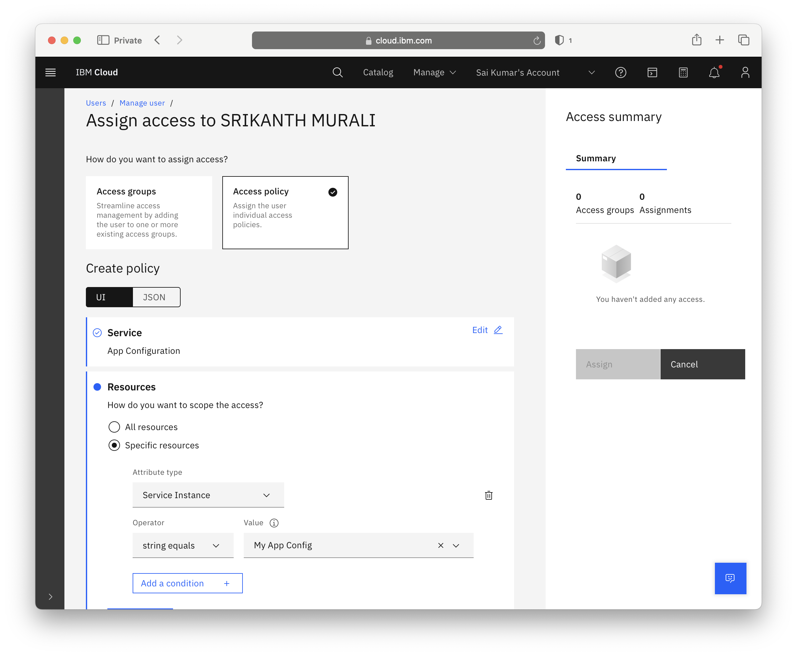
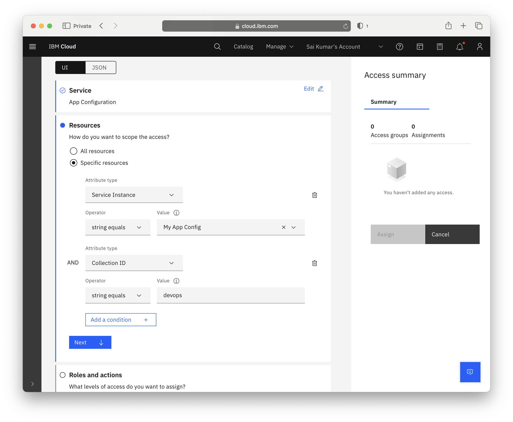
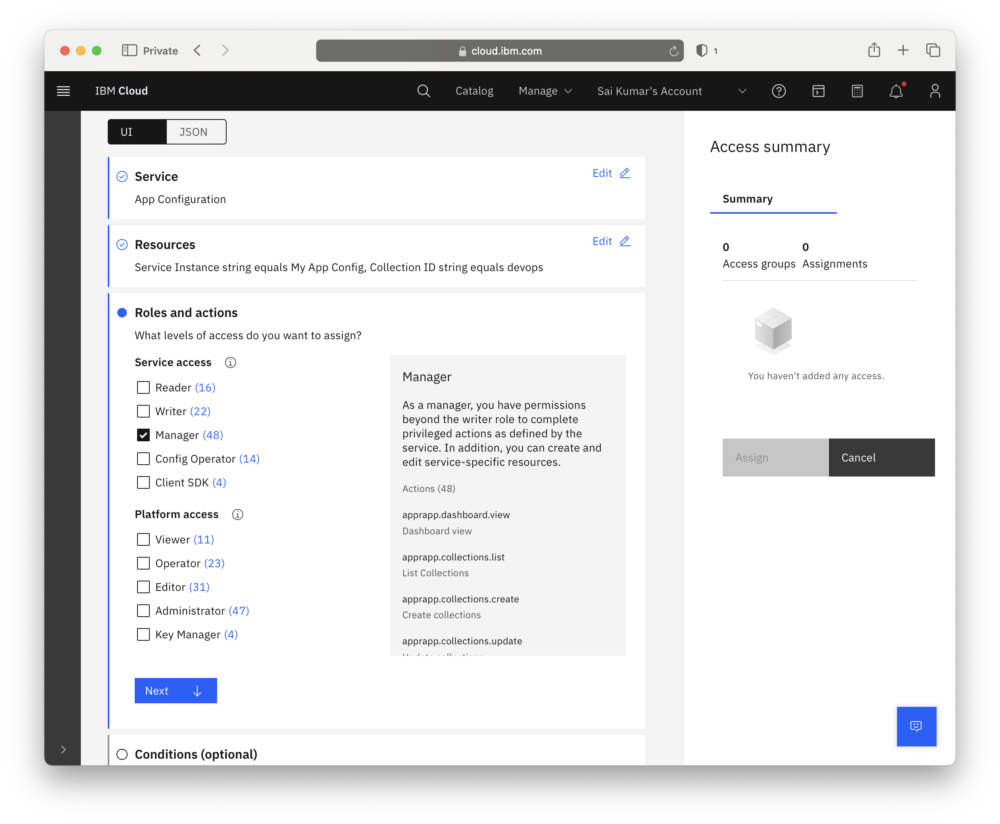
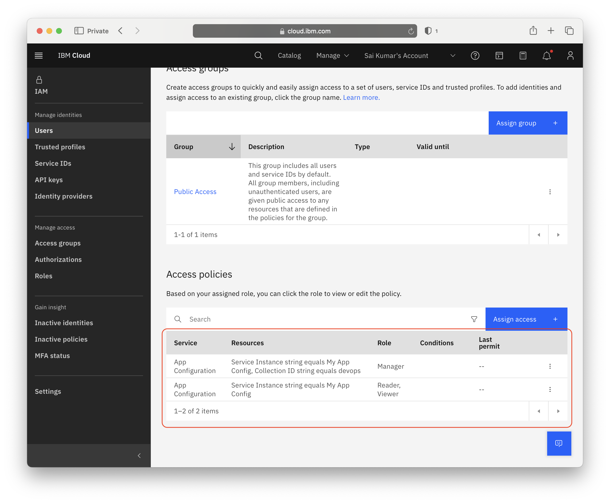
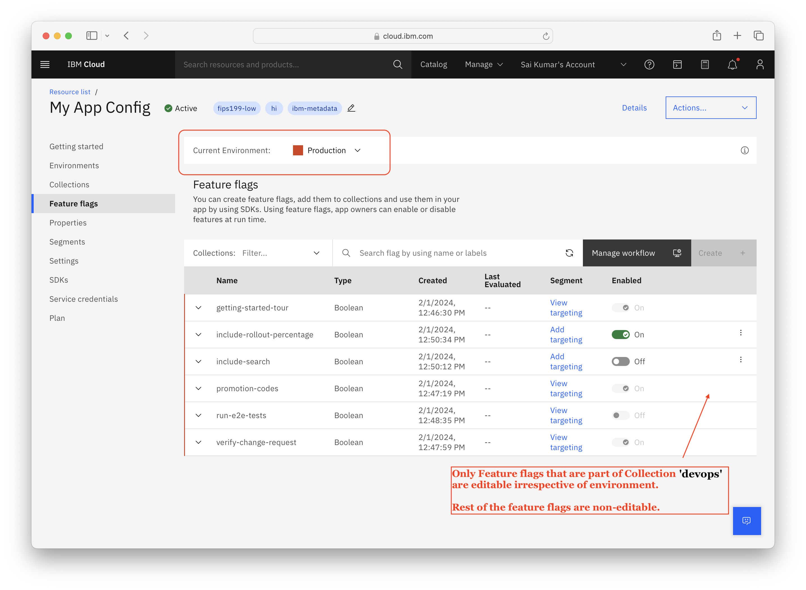

---

copyright:
  years: 2020, 2024
lastupdated: "2024-02-06"

keywords: app-configuration, app configuration, managing service access, iam, account, collections

subcollection: app-configuration

content-type: tutorial
account-plan: standard
completion-time: 15m

---

{{site.data.keyword.attribute-definition-list}}

# Assigning access to an individual collection
{: #ac-assign-access-to-collections}
{: toc-content-type="tutorial"}
{: toc-completion-time="15m"}

This tutorial shows you how to assign access roles for Users against Collections, by creating and modifying IAM access policies.
{: shortdesc}

## Before you begin
{: #collection-access-step-0}

If you are already managing instances of App Configuration or IAM, you do not need to create more. However, as this tutorial will modify and configure the instance we are working with, make sure that any accounts or services are not being used in a production environment.

For this tutorial, you need:

- An {{site.data.keyword.cloud}} Platform account
- An instance of {{site.data.keyword.cloud_notm}} {{site.data.keyword.appconfig_short}}
- A Collection to which a user should be constrained
- To complete the steps to manage access to the service, you should be the owner of the {{site.data.keyword.appconfig_short}} instance. In other words, your user ID needs **administrator platform permissions** to use the IAM service. You may have to contact or work with an account administrator.

## Grant Reader access to App Configuration instance
{: #collection-access-step-1}
{: step}

To enable access to a specific collection in an instance, the user must at least have **Reader** level privileges to the particular {{site.data.keyword.appconfig_short}} instance.
{: note}

1. Navigate to IAM by following the **Manage** drop-down menu, and selecting **Access (IAM)**. Follow the **Users** link in the navigation menu, and select the user requiring limited access.
2. Click on the **Assign access** button. Select the **Access policy** tile and select **App Configuration**.
3. Select the radio toggle next to **Specific resources**. Select **Service Instance** from the _Attribute type_ drop-down menu. Select the {{site.data.keyword.appconfig_short}} instance which you want to assign access.

  {: caption="Figure 1: Selecting App Configuration instance."}

4. In the _Roles and access_ section, select the role **Reader**. You'll also need the Platform **Viewer** role, if you don't already have it, in order to view the UI.

  {: caption="Figure 2: Selecting Roles for App Configuration instance."}

5. Click **Add**.

## Grant Manager access to specific Collection
{: #collection-access-step-2}
{: step}

We'll repeat the step 1, but this time we'll use **Collection ID** resource attribute and select **Manager** role.

1. Click on the **Assign access** button. Select the **Access policy** tile and select **App Configuration**.
2. Select the radio toggle next to **Specific resources**. Select **Service Instance** from the _Attribute type_ drop-down menu. Select the {{site.data.keyword.appconfig_short}} instance which you want to assign access.
3. Add another _Attribute type_ by clicking on **Add a condition** button. Select **Collection ID** from the drop-down menu. Type in the ID of the collection that the user should be able to access in the _Value_ field.  In this case, it's a collection called `devops`.

  {: caption="Figure 3: Adding resource attribute."}

4. In the _Roles and access_ section, select the role **Manager**.

  {: caption="Figure 4: Selecting Roles for resource attribute."}

5. Click **Add**.

## Review access policies
{: #collection-access-step-3}
{: step}

At this stage, you should have two access policies created as shown below. One access policy with **Reader & Viewer**, another with **Manager** role.

  {: caption="Figure 5: Review access policies created."}

## Verify that it works
{: #collection-access-step-4}
{: step}

When this {{site.data.keyword.appconfig_short}} instance is accessed by shared user, only those **Feature flags** & **Properties** which belong to Collection that is given Manager access are **editable** irrespective of the current Environment. In other words, these Feature flags & Properties are editable under any environment. Rest of the Feature flags & Properties which belong to different Collections are **non-editable**.

  {: caption="Figure 6: Only those Feature flags which are part of collection `devops` are allowed to edit under environment `dev`."}

  {: caption="Figure 7: Only those Feature flags which are part of collection `devops` are allowed to edit under environment `production` too."}

When shared user tries to perform any action such as toggle or update on feature flags that belong to different collection using API/CLI/Terrform, the action is denied with **401** status code as shown below.
{: note}

```javascript
{
  "status_code": 401,
  "message": "unauthorized: Looks like you do not have access to requested resource or action is not permitted for the corresponding IAM role. If this is a shared resource, please check if access policies are rightly created.",
  "trace": "appconfig-txid-a560b9c5a4dfe218eafbde5419e1651f"
}
```
{: codeblock}

## Next steps
{: #collection-access-next-steps}

Congratulations, you've just set up policies that limit access to a single collection.
