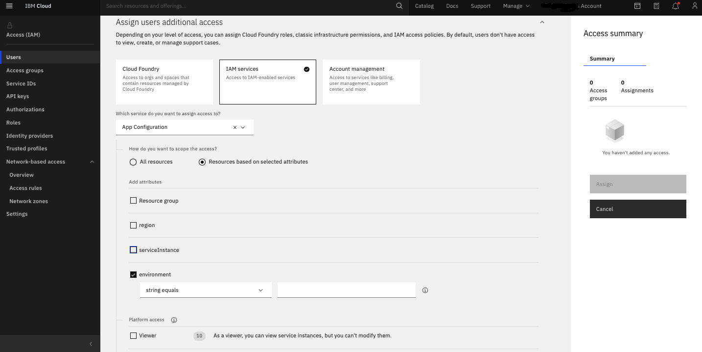
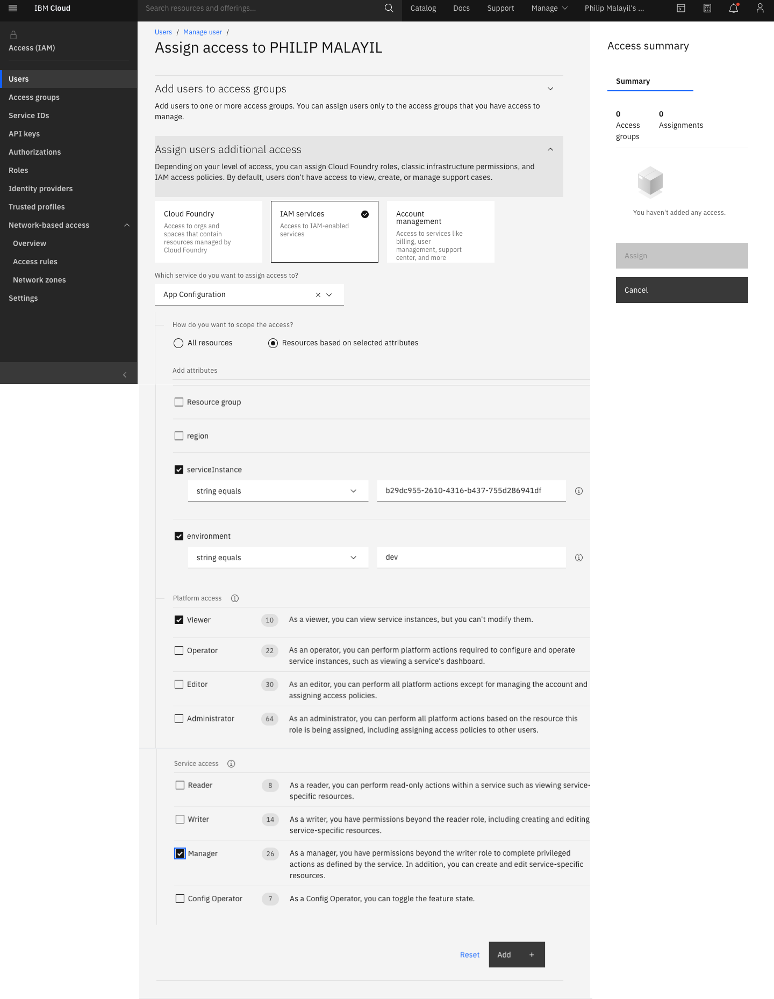

---

copyright:
  years: 2020, 2021
lastupdated: "2021-07-06"

keywords: app-configuration, app configuration, managing service access, iam, account, environments

subcollection: app-configuration

---

{:codeblock: .codeblock}
{:external: target="_blank" .external}
{:important: .important}
{:note: .note}
{:pre: .pre}
{:screen: .screen}
{:shortdesc: .shortdesc}
{:tip: .tip}

# Managing access levels for {{site.data.keyword.appconfig_short}} environments
{: #ac-service-access-level-management}

You can enable different levels of access to an {{site.data.keyword.appconfig_short}} environment in your {{site.data.keyword.Bluemix_notm}} account by creating and modifying {{site.data.keyword.iamlong}} (IAM) access policies.
{: shortdesc}

## Granting access to an environment across instances in the account
{: #ac-access-management-env}

Carry out the following steps on the {{site.data.keyword.Bluemix_notm}} console:

1. From the menu bar, click **Manage > Access (IAM)**, and select **Users** to browse the existing users in your account.
1. Select the name of the user to assign the access.
1. Click **Access policies** tab in the Manager page view.
1. Click **Assign access**.
1. Select the **Assign users additional access** section if it is not already expanded.
1. From the list of services, select {{site.data.keyword.appconfig_short}}.
1. Select the **Resource based on selected attributes** option.
1. Select the **environment** and provide the environment ID as the value.
1. Choose a combination of [platform and service access roles](https://cloud.ibm.com/docs/app-configuration?topic=app-configuration-ac-service-access-management) to assign access for the user.
1. Click **Add**.
1. Continue to add platform and service access roles as needed and when you are finished, click **Assign**.

{: caption="Figure 1." caption-side="bottom"}

To enable access to environments across instances, the user must atleast have Reader level privileges to the {{site.data.keyword.appconfig_short}} instances in the account.
{: note}  

## Granting access to a specific environment in an instance
{: #ac-access-management-instance}

Carry out the following steps on the {{site.data.keyword.Bluemix_notm}} console:

1. From the menu bar, click **Manage > Access (IAM)**, and select **Users** to browse the existing users in your account.
1. Select the name of the user to assign the access.
1. Click Access policies tab in the Manager page view.
1. Click Assign access.
1. Select the **Assign users additional access** section if it is not already expanded.
1. From the list of services, select {{site.data.keyword.appconfig_short}}.
1. Select the **Resource based on selected attributes** option.
1. Select the **serviceInstance** attribute and provide the service instance ID as the value.
1. Select the **environment** and provide the environment ID as the value.
1. Choose a combination of [platform and service access roles](https://cloud.ibm.com/docs/app-configuration?topic=app-configuration-ac-service-access-management) to assign access for the user.
1. Click **Add**.
1. Continue to add platform and service access roles as needed and when you are finished, click **Assign**.

{: caption="Figure 2." caption-side="bottom"}

To enable access to a specific environment in an instance, the user must at least have Reader level privileges to the particular {{site.data.keyword.appconfig_short}} instance.
{: note}
