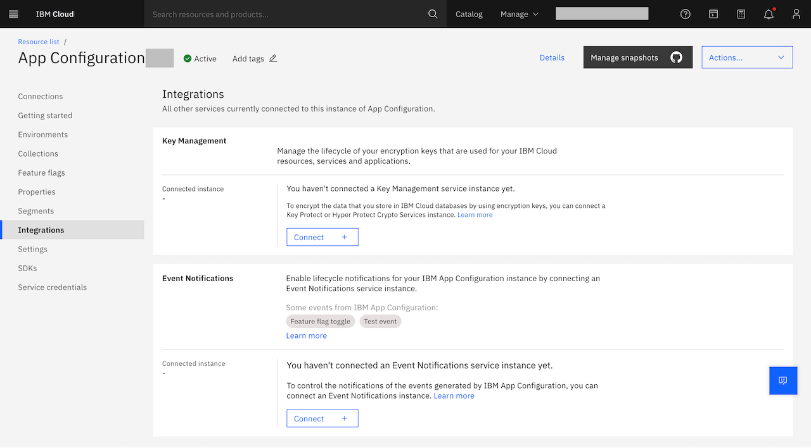

---

copyright:
  years: 2022, 2023
lastupdated: "2023-01-31"

keywords: app-configuration, app configuration, integrations, key protect, key management, hyper protect, hpcs, event notifications, en

subcollection: app-configuration

---

{{site.data.keyword.attribute-definition-list}}

# Integrations
{: #ac-integrations}

Integrations in {{site.data.keyword.appconfig_short}} represent list of other {{site.data.keyword.cloud_notm}} services that are connected to your {{site.data.keyword.appconfig_short}} instance.
{: shortdesc}

The **Integrations** page displays the services supported along with integrations in the current {{site.data.keyword.appconfig_short}} service. Following service integrations are supported:

{: caption="Figure 1. List of integrations" caption-side="bottom"}

1. **Key Management** - You can encrypt the data that you store in {{site.data.keyword.cloud_notm}} databases by using encryption keys that you can control. Manage the lifecycle of your encryption keys that are used for your {{site.data.keyword.cloud_notm}} resources, services and applications. For more information, see [Integrating with a Key management service](/docs/app-configuration?topic=app-configuration-ac-int-key-management).

1. **{{site.data.keyword.en_short}}** - Enable lifecycle notifications for your {{site.data.keyword.appconfig_short}} instance by connecting an {{site.data.keyword.en_short}} service instance. For more information, see [Integrating with {{site.data.keyword.en_short}} service](/docs/app-configuration?topic=app-configuration-ac-int-en).

