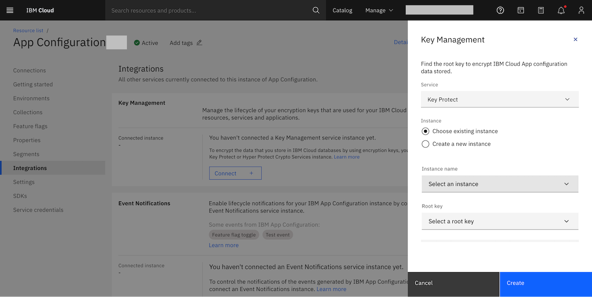

---

copyright:
  years: 2022, 2025
lastupdated: "2025-10-08"

keywords: app-configuration, app configuration, integrations, key protect, key management, hyper protect, hpcs

subcollection: app-configuration

---

{{site.data.keyword.attribute-definition-list}}

# Integrating with Key Management
{: #ac-int-key-management}

You can encrypt the data that you store in {{site.data.keyword.cloud_notm}} databases by using encryption keys that you can control. Manage the lifecycle of your encryption keys that are used for your {{site.data.keyword.cloud_notm}} resources, services and applications.
{: shortdesc}

You can use either one of the following options:
- Bring Your Own Key (BYOK) through {{site.data.keyword.keymanagementservicelong_notm}}, and use one of your own keys to encrypt your databases and backups.
- Hyper Protect Crypto Services (HPCS) - {{site.data.keyword.cloud}} {{site.data.keyword.hscrypto}}, a dedicated key management service, and Hardware Security Module (HSM) that provides you with the Keep Your Own Key capability for cloud data encryption with exclusive control of your encryption keys.

BYOK and KYOK capabilities are supported only for {{site.data.keyword.appconfig_short}} Enterprise plan.
{: important}

For more information, see [Managing encryption](/docs/app-configuration?topic=app-configuration-ac-managing-encryption).

If you are using {{site.data.keyword.appconfig_short}} CLI or API to create integration with a key management service (KMS), ensure that you have enabled authorization to grant access between services before integrating with a KMS service. For more information, see [Using authorizations to grant access between services](#ac-using-auth-access-between-services).
{: important}

You can create and bring keys that are created by using {{site.data.keyword.keymanagementserviceshort}} or {{site.data.keyword.hscrypto}}. To get started, you need [{{site.data.keyword.keymanagementserviceshort}}](https://cloud.ibm.com/catalog/services/key-protect){: external} or [{{site.data.keyword.hscrypto}}](https://cloud.ibm.com/catalog/services/hyper-protect-crypto-services) provisioned on your {{site.data.keyword.cloud_notm}} account. For more information, see [provisioning a key protect instance](/docs/key-protect?topic=key-protect-provision){: external} or see [provisioning a {{site.data.keyword.hscrypto}} instance](/docs/hs-crypto?topic=hs-crypto-get-started){: external}.

To integrate with a key management service, perform the following steps:

1. From your {{site.data.keyword.appconfig_short}} service instance dashboard, click **Integrations**. By default, the integrations displays the services supported along with integrations in the current {{site.data.keyword.appconfig_short}} service.

1. From **Key Management** tile, click **Connect +**. This displays the **Key Management** side panel.

   {: caption="Create KMS integration" caption-side="bottom"}

1. Select **Key Protect** or **Hyper Protect Crypto Services** from the **Service** drop-down list, as per your requirement.

1. For the **Instance**, select one of these options:
   - **Create a new instance** - to create a new instance of the selected service. Selecting this option takes you to the respective provisioning page of the service selected.
   - **Choose existing instance** - select this option if you already have a {{site.data.keyword.keymanagementserviceshort}} or {{site.data.keyword.hscrypto}} instance. Select the **Instance name** and **Root key** from the drop-down list.

1. Click **Create** to apply the use of your {{site.data.keyword.keymanagementserviceshort}} or {{site.data.keyword.hscrypto}} instance's root key to encrypt the segment data stored by your {{site.data.keyword.appconfig_short}} instance.

The newly created **Key Management** information is listed under **Connected instance**.

When an {{site.data.keyword.appconfig_short}} instance is deleted, unregistration of the resource with key management services automatically happens. If any error, you can manually unregister {{site.data.keyword.appconfig_short}} instance from key management service by using the {{site.data.keyword.cloud_notm}} console dashboard.
{: note}

## Using authorizations to grant access between services
{: #ac-using-auth-access-between-services}

Use {{site.data.keyword.cloud}} Identity and Access Management (IAM) to create or remove an authorization that grants one service access to another service. Use authorization delegation to automatically create access policies that grant access to dependent services.

### Creating an authorization in the console
{: #ac-create-auth-console}

1. In the {{site.data.keyword.cloud_notm}} console, click **Manage** > **Access (IAM)**, and select **Authorizations**.

1. Click **Create**.

1. Select a source account.
   * If the source service that needs access to the target service is in this account, select **This account**.
   * If the source service that needs access to the target service is in a different account, select **Other account**. Then, enter the **Account ID** of the source account.

1. Select a **Source service** as **App Configuration**.

1. Specify whether you want the authorization to be for all resources or Resources based on selected attributes. If you selected Resources based on selected attributes, then specify the **Add attributes**: only source resource group or only source service instance.

1. Select a **Target service** as per your requirement (Key Protect or Hyper Protect Crypto Services).

1. For the target service, specify whether you want the authorization to be for all instances, only to a specific instance in the account, or instances only in a certain resource group.

1. Select a role to assign access to the source service that accesses the target service.

1. Click **Authorize**.

### Creating an authorization by using the CLI
{: #ac-create-auth-cli}

To authorize a source service access a target service, run the `ibmcloud iam authorization-policy-create` command.

For more information about all of the parameters that are available for this command, see [ibmcloud iam authorization-policy-create](/docs/cli?topic=cli-ibmcloud_commands_iam#ibmcloud_iam_authorization_policy_create).
