---

copyright:
  years: 2023, 2024
lastupdated: "2024-02-19"

keywords: app-configuration, app configuration, feature flags, manage workflow, ServiceNow

subcollection: app-configuration

---

{{site.data.keyword.attribute-definition-list}}

# Manage workflow
{: #ac-manage-workflow}

As an app owner, you can manage feature flags enablement by adding additional workflow with ServiceNow&reg; integration with {{site.data.keyword.appconfig_short}}.
{: shortdesc}

You can associate the approval process flow for any configuration changes to {{site.data.keyword.appconfig_short}} at the environment level. When you enable the approval workflow, the changes are reflected only after the approval and moving the change request state to implement. Once, the change request is in implement state the changes will be automatically reflected.

Make sure you have an ServiceNow instance with admin privileges to update the configuration.
{: note}

The ServiceNow name follows the standard `https://xxx.service-now.com`, where `xxx` is your instance name. The ServiceNow instance name, Username, and Password can be fetched from your ServiceNow console. Navigate to your ServiceNow profile and go to **Manage Instance Password** to get the details.
{: important}

To integrate with ServiceNow workflow, perform the following steps:

1. From your {{site.data.keyword.appconfig_short}} service instance dashboard, select value for the **Current Environment** field. This value should be the environment for which you want to enable the ServiceNow workflow process.

1. Click **Feature flags**.

1. Click **Manage Workflow**. The **Manage workflow** side-panel displays.

   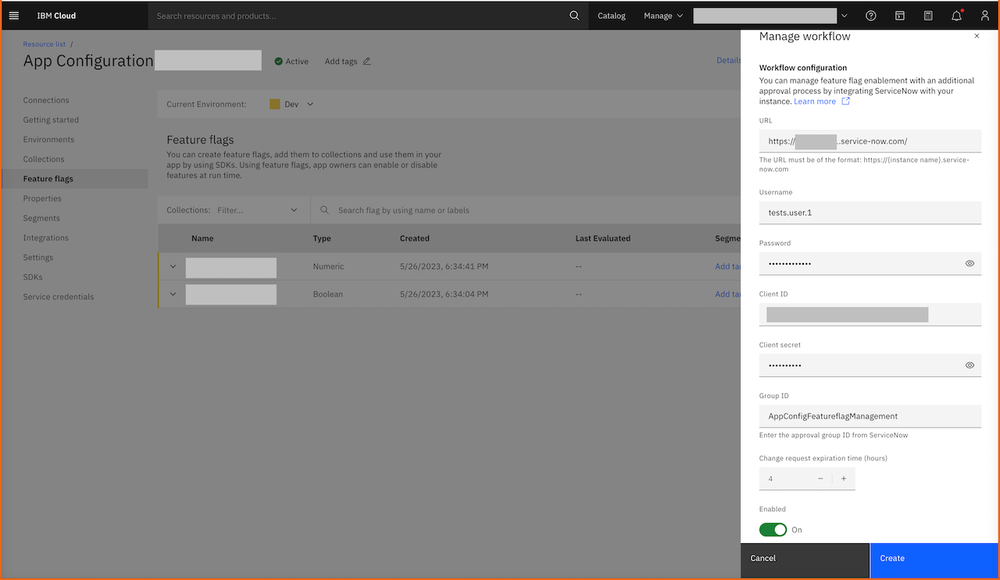{: caption="Figure 1. Manage workflow" caption-side="bottom"}

1. Enter the **URL** of the ServiceNow instance.

1. Enter the **Username** to be used for connecting to the ServiceNow instance.

1. Enter the **Password** to be used for authenticating the *Username* mentioned earlier to authenticate in the ServiceNow instance.

1. Enter the **Client ID** needed to retrieve the OAuth access token.

   **Client ID** and **Client secret** are required for accessing your ServiceNow instance. For creating a **Client ID** and **Client secret**, check the service now documentation on how to [create an OAuth API endpoint for external clients](https://docs.servicenow.com/csh?context=CSHelp%3AOAuthSetup){: external}.
   {: important}

1. Enter the **Client secret** required for authenticating the *Client ID* provided earlier.

1. Enter the approval **Group Name** defined in ServiceNow. The approval Group Name will contain set of people who are authorized to approve the Change Requests created in the ServiceNow workflow.

1. Set the Change request expiration time (in hours). Minimum 1 to maximum 999 hours.

1. Set the **Enabled** toggle switch to **ON** to enable the workflow for selected environment.

1. Click **Create** to create and apply the workflow.

When you create a workflow in an environment, toggling the feature flags to *On* state or *OFF* state in that environment will initiate a change request and need to go through the workflow approval process.

If you have already enabled some feature flags before applying the workflow approval process, those feature flags will function as usual but further toggling will go through an approval process.

If you disable an existing feature flag and apply the workflow, and then enable the feature flag, its status changes to *Workflow initiated* and a change request workflow will be initiated.

## How to add a mandatory tag to the ServiceNow workflow change request?
{: #ac-sn-mandatory-tag}

Follow these steps to add a mandatory tag to the change request for the ServiceNow workflow integration:

1. Login to your ServiceNow instance as an administrator.

1. Open an existing Change Request.

   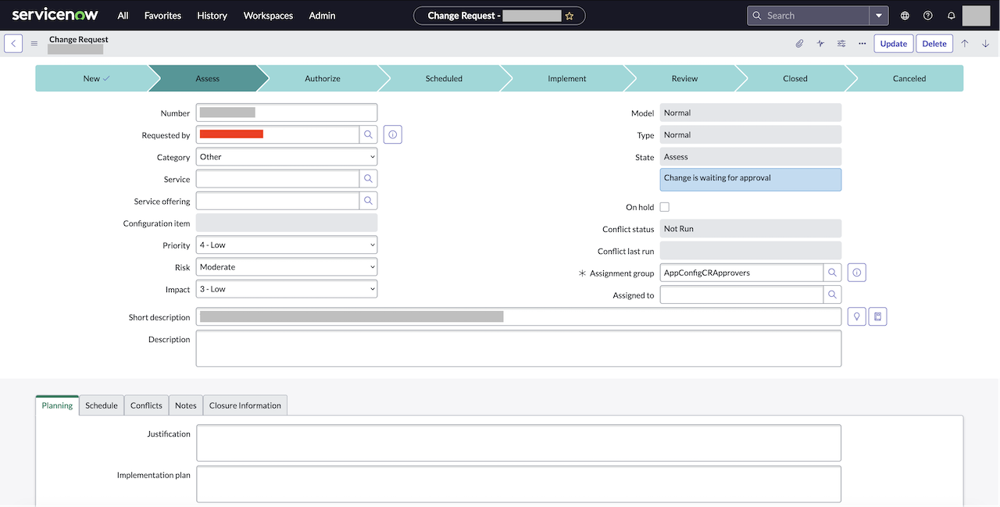{: caption="Figure 2. ServiceNow change request" caption-side="bottom"}

1. Click the additional actions icon to open up the additional options.

   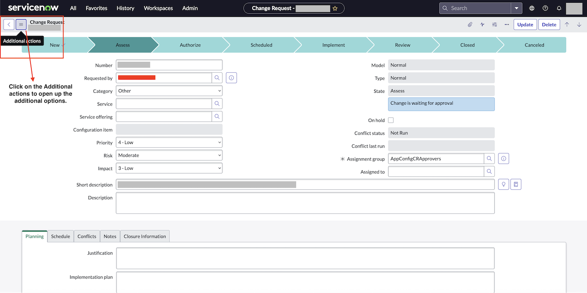{: caption="Figure 3. ServiceNow additional actions" caption-side="bottom"}

1. Click **Configure** and select the **Form Layout**.

   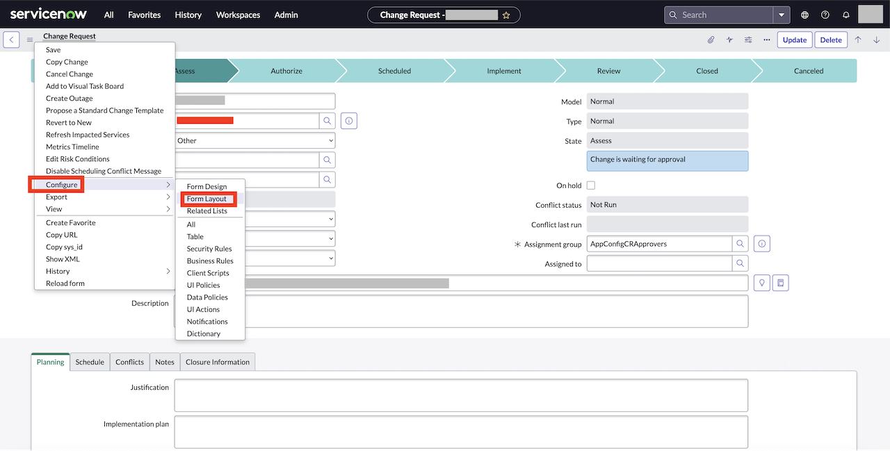{: caption="Figure 4. ServiceNow additional configure option - Form Layout" caption-side="bottom"}

1. In the **Form Layout** under **Form view and section**, select **Change Request** and create a new field with **Name** exactly as *Appconfiguration tag*, **Type** as *String*, and **Field length** as *Medium (100)*.

   Make sure to enter the field Name exactly as **Appconfiguration tag** (case sensitive).
   {: note}

   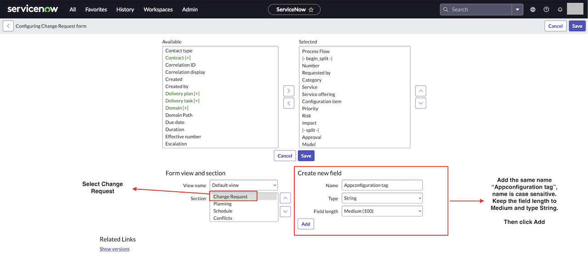{: caption="Figure 5. ServiceNow additional configure option - Form Layout - Create new field" caption-side="bottom"}

1. Click **Add**. Once added, the new field will be shown in the **Available** section.

   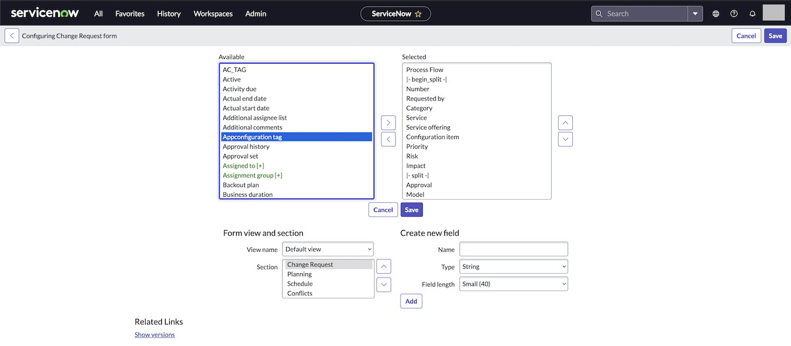{: caption="Figure 6. ServiceNow additional configure option - Form Layout - new field displayed in Available section" caption-side="bottom"}

1. Select *Appconfiguration tag* from the **Available** section and add it to **Selected** section.

   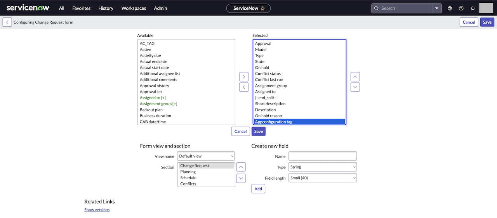{: caption="Figure 7. ServiceNow additional configure option - Form Layout - selecting new field from Available section to Selected section" caption-side="bottom"}

1. You can see the new field appearing in the change request.

   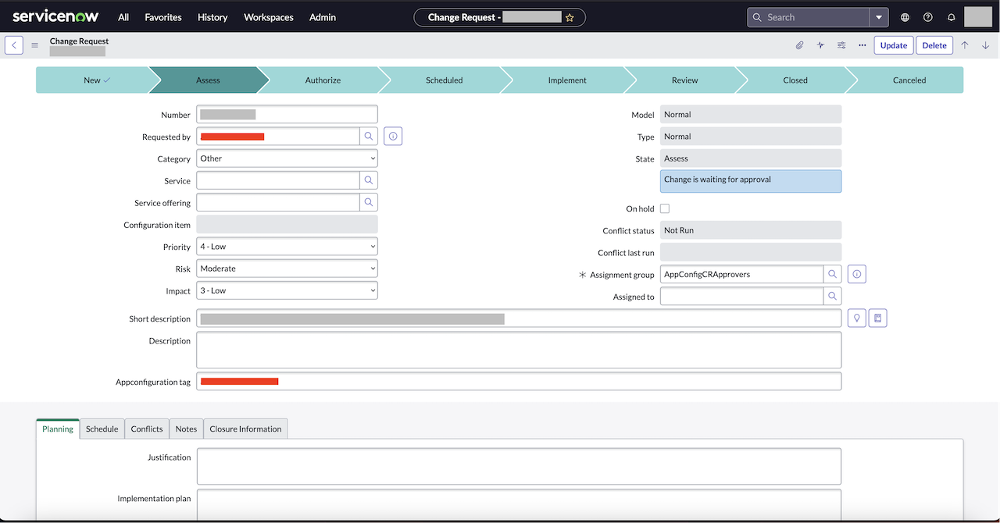{: caption="Figure 8. New field displayed in the change request" caption-side="bottom"}

   Field value is added by {{site.data.keyword.appconfig_short}} service while creating new change requests. Hence, do not modify the value or add any other value to **Appconfiguration tag** field. Modifying or adding any other value to the field can lead to ignoring the change request events.
   {: important}

## How to register or add webhook script to your ServiceNow instance?
{: #ac-sn-add-webhook-script}

Follow these steps to register or add webhook script to your ServiceNow instance:

1. Login to your ServiceNow instance as an administrator.

1. Click the **All** tab and search for *Business Rules listed under System Definitions*.

   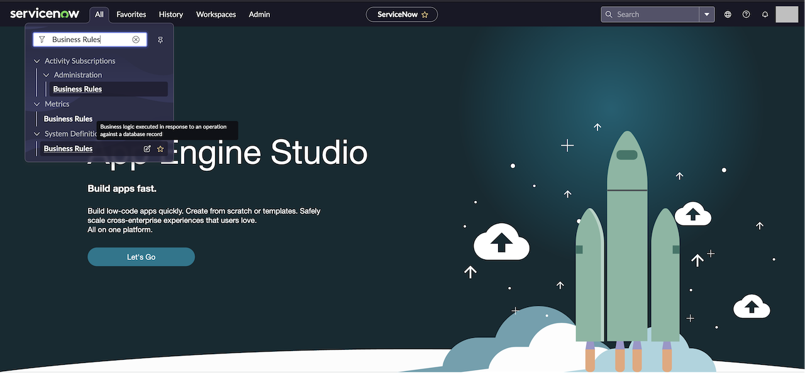{: caption="Figure 9. ServiceNow - Business Rules listed under System Definitions" caption-side="bottom"}

1. In the **Business Rules** page, click the **New** button.

   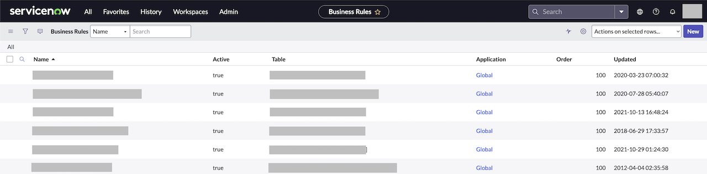{: caption="Figure 10. ServiceNow - Create new business rule" caption-side="bottom"}

1. In the new record, add the **Name**, select the table to be *Change Request*. Select the **Advanced** check box to see the advanced option tab.

   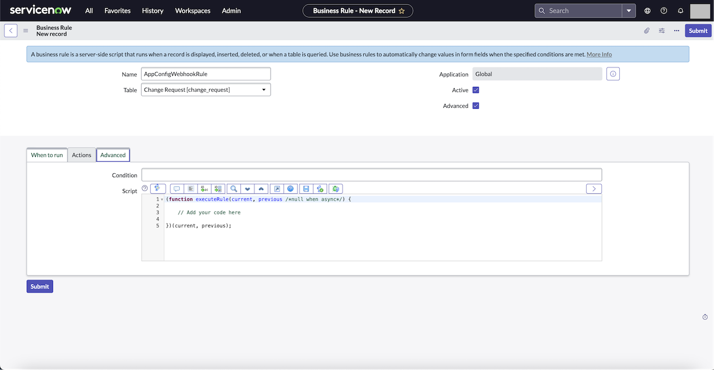{: caption="Figure 11. Advanced option to add webhook script" caption-side="bottom"}

1. In the **Advanced** option tab, add the webhook script.

   ```javascript
   (function executeRule(current, previous /*null when async*/) {
      try {
         if (current.u_appconfiguration_tag == "appconfig-workflow" && (current.state == -1 || current.state == -5 || current.state == 4)) {
               //creating the glider Encrypt object
               var glideEncrypt = new GlideEncrypter();
               //fetching the sys_property that contains the IAM key
               var encryptedIbmIAMKey = gs.getProperty('<Add System property name which holds the IBM IAM key (Case Sensitive)>');
               //example: var encryptedKey = gs.getProperty('WorkflowAppConfigIamKey'); 
               //Decrypting the key
               var decryptedIAMKey = glideEncrypt.decrypt(encryptedIbmIAMKey);
               gs.addInfoMessage("IBM KEY DECRYPTION COMPLETED");
               if (Object.keys(decryptedIAMKey).length !== 0) {
                  gs.addInfoMessage("CHANGE REQUEST IDENTIFIED AS WORKFLOW RELATED");
                  //Adding the decrypted key to the IAM token generation body
                  var bodyContent = "grant_type=urn:ibm:params:oauth:grant-type:apikey&apikey=" + decryptedIAMKey;
                  //Making POST call to IBM IAM to generate token
                  var ibmIamTokenRequest = new sn_ws.RESTMessageV2();
                  ibmIamTokenRequest.setHttpMethod('POST');
                  ibmIamTokenRequest.setEndpoint('https://iam.cloud.ibm.com/identity/token');
                  ibmIamTokenRequest.setRequestBody(bodyContent);
                  ibmIamTokenResponse = ibmIamTokenRequest.execute();
                  var ibmIamTokenResponseCode = ibmIamTokenResponse.getStatusCode();
                  gs.addInfoMessage("IBM IAM TOKEN CREATION HTTP RESPONSE CODE: " + ibmIamTokenResponseCode);
                  if (ibmIamTokenResponseCode == 200) {
                     //parsing json response to extract the access_token
                     var ibmIamTokenResponseData = JSON.parse(ibmIamTokenResponse.getBody());

                     //extracting the access_token
                     var access_token = ibmIamTokenResponseData.access_token;
                     var encryptedInstanceId = gs.getProperty('<Add System property name which holds the AppConfig InstanceId (Case Sensitive)>');
                     //example: var encryptedInstanceId = gs.getProperty('WorkflowIbmAppConfigInstanceId');
                     var decryptedInstanceId = glideEncrypt.decrypt(encryptedInstanceId);
                     gs.addInfoMessage("IBM APP CONFIG INSTANCE ID DECRYPTION COMPLETED");
                     //preparing webhook request to forward
                     var webHookRequest = new sn_ws.RESTMessageV2();
                     //Refer link https://cloud.ibm.com/apidocs/app-configuration#endpoints-urls for more info on base URL
                     //Choose the base url from below based on your AppConfig instance region
                     //Dallas: https://us-south.apprapp.cloud.ibm.com
                     //Washington DC: https://us-east.apprapp.cloud.ibm.com
                     //London: https://eu-gb.apprapp.cloud.ibm.com
                     //Sydney: https://au-syd.apprapp.cloud.ibm.com

                     webHookRequest.setEndpoint('{{AppConfigRegionBaseURL}}/apprapp/workflow/v1/instances/' + decryptedInstanceId + '/crevents');
                     webHookRequest.setRequestHeader('Authorization', 'Bearer ' + access_token);
                     webHookRequest.setHttpMethod('POST');
                     webHookRequest.setRequestHeader("Accept", "application/json");
                     webHookRequest.setRequestHeader("Content-Type", "application/json");

                     //preparing the data for the webhook request
                     var webHookReqDataObject = new Object();
                     //BELOW ARE THE DATA THAT IS NEEDED TO PROCESS THE REQUEST, MODIFYING OR ALTERING THE DATA OR THE ATTRIBUTE WILL RESULT IN WEBHOOK REQUEST FAILURE.
                     webHookReqDataObject.operation = String(current.operation());
                     webHookReqDataObject.short_description = String(current.short_description);
                     webHookReqDataObject.change_request_id = String(current.number);
                     webHookReqDataObject.description = String(current.description);
                     webHookReqDataObject.cr_state = String(current.state);
                     webHookReqDataObject.cr_approval_assignment_group = String(current.assignment_group);
                     webHookReqDataObject.appconfiguration_tag = String(current.u_appconfiguration_tag);
                     webHookReqDataObject.implementation_time = String(current.work_start);
                     var webHookJsonStringData = JSON.stringify(webHookReqDataObject);
                     gs.addInfoMessage(webHookJsonStringData);
                     webHookRequest.setRequestBody(webHookJsonStringData);

                     //checking the change request has the tag, we only accept the CR with the below mentioned tag id 
                     gs.addInfoMessage("SENDING REQUEST TO APP CONFIGURATION WEBHOOK HANDLER");
                     var webHookResponse = webHookRequest.execute();
                     httpResponseStatus = webHookResponse.getStatusCode();
                     gs.addInfoMessage("APP CONFIGURATION WEBHOOK HANDLER RESPONSE CODE:  " + httpResponseStatus);
                     if (httpResponseStatus == 200) {
                           gs.addInfoMessage("SUCCESSFULLY EXECUTED THE WEBHOOK CALL");
                     } else {
                           //try once more
                           webHookResponse = webHookRequest.execute();
                           httpResponseStatus = webHookResponse.getStatusCode();
                           gs.addInfoMessage("WEBHOOK CALL RETRY STATUS CODE:  " + httpResponseStatus);
                           gs.addInfoMessage(webHookResponse.getBody());
                     }
                  } else {
                     gs.addInfoMessage("IBM IAM TOKEN GENERATION FAILED");
                  }
               } else {
                  gs.addInfoMessage("DECRYPTED IAM KEY IS EMPTY OR NOT FOUND");
               }
         } else {
               gs.addInfoMessage("CR STATE : " + current.state + " CR APPCONFIGURATION TAG VALUE : " + current.u_appconfiguration_tag);
               gs.addInfoMessage("CHANGE REQUEST DOES NOT BELONG TO WORKFLOW INTEGRATION OR STATE OF THE CR IS NOT VALID");
         }
      } catch (ex) {
         var message = ex.getMessage();
         gs.info(message);
      }
   })(current, previous);
   ```
   {: codeblock}

1. Modify the copied script with your IBM IAM token or {{site.data.keyword.appconfig_short}} service credentials' API key and {{site.data.keyword.appconfig_short}} instance ID.

1. Navigate to **When to run** tab and select the **Update** checkbox.

   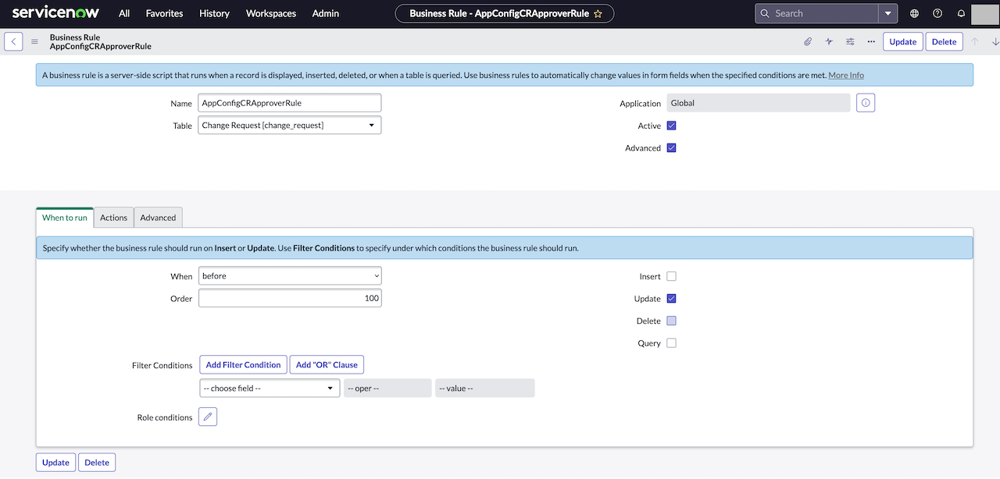{: caption="Figure 12. ServiceNow - When to run tab" caption-side="bottom"}

1. Click **Submit** to save the details.

## How to add IBM IAM token or {{site.data.keyword.appconfig_short}} service credentials' API key for the webhook script?
{: #ac-sn-add-iam-token}

Webhook script needs IBM IAM token for the webhook calls or {{site.data.keyword.appconfig_short}} service credentials' API key, where you can store the API key to generate the token.

Follow these steps:

1. Login to your ServiceNow instance as an administrator.

1. Click the **All** tab and search for *sys_properties.LIST* and press **Enter**. Alternately, you can go to https://{{instanceid}}.service-now.com/sys_properties_list.do, where **instanceid** is your ServiceNow instance ID.

   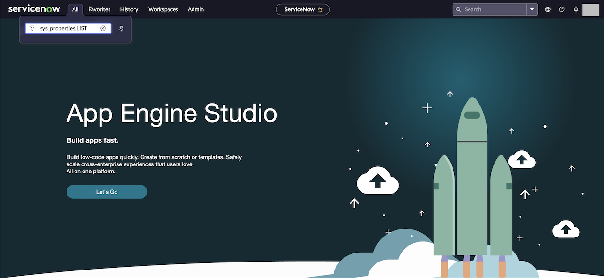{: caption="Figure 13. ServiceNow - All tab" caption-side="bottom"}

1. The **System properties** details gets displayed.

   {: caption="Figure 14. ServiceNow - System properties" caption-side="bottom"}

1. Click **New** to create a new system property.

   {: caption="Figure 15. ServiceNow - New system property" caption-side="bottom"}

1. Add the following details to add the token. Use the password2 type to store the key. This type will encrypt the data and can only be decrypted with the ServiceNow instance.

   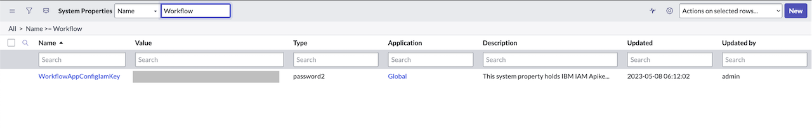{: caption="Figure 16. ServiceNow - System property" caption-side="bottom"}

1. Click **Submit** to save the key in ServiceNow instance. Once saved, you can see that the data is encrypted.

## How to add the {{site.data.keyword.appconfig_short}} instance ID to ServiceNow system property for the webhook script?
{: #ac-sn-add-ac-instance-id}

Follow these steps:

1. Login to your ServiceNow instance as an administrator.

1. Click the **All** tab and search for *sys_properties.LIST* and press **Enter**. Alternately, you can go to https://{{instanceid}}.service-now.com/sys_properties_list.do, where **instanceid** is your ServiceNow instance ID.

   {: caption="Figure 17. ServiceNow - All tab" caption-side="bottom"}

1. The **System properties** details gets displayed.

   {: caption="Figure 18. ServiceNow - System properties" caption-side="bottom"}

1. Click **New** to create a new system property.

   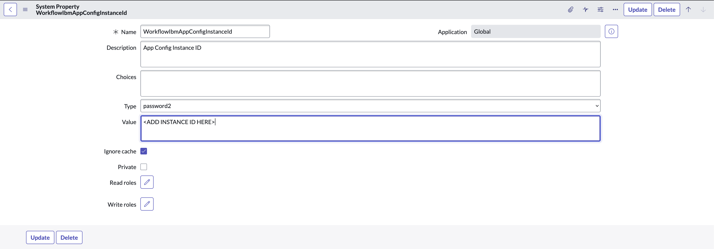{: caption="Figure 19. ServiceNow - New system property" caption-side="bottom"}

1. Add the {{site.data.keyword.appconfig_short}} instance ID. Use the password2 type to store the key. This type will encrypt the data and can only be decrypted with the ServiceNow instance.

   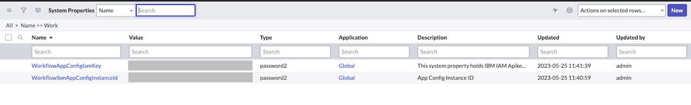{: caption="Figure 20. ServiceNow - System property" caption-side="bottom"}

1. Click **Submit** to save the key in ServiceNow instance. Once saved, you can see that the data is encrypted.

