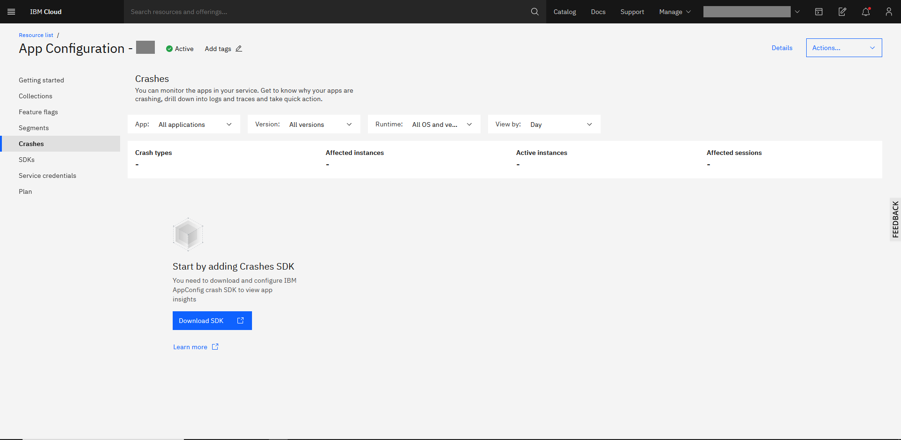

---

copyright:
  years: 2020
lastupdated: "2020-11-11"

keywords: app-configuration, app configuration, managing service access, monitor apps, crash analytics

subcollection: app-configuration

---

{:codeblock: .codeblock}
{:external: target="_blank" .external}
{:important: .important}
{:note: .note}
{:pre: .pre}
{:screen: .screen}
{:shortdesc: .shortdesc}
{:tip: .tip}

# Monitor Apps
{: #ac-monitor-apps}

{{site.data.keyword.appconfig_short}} helps you to monitor your Node.js microservice apps in the runtime. The dashboard displays the status of all your app. You can view the stack trace of your apps crashes.
{: shortdesc}

The Crash analytics view helps you with insights as to how stable your application was between a selected time period and helps you decide whether your application design or implementation must be fixed. It provides charts that contrast the number of crashes against the total number of uses and the overall crash rate. The charts in this view can be filtered on app name, operating system or operating system version.

Make sure you configure your app with crash analytics client SDK as detailed [here](/docs/app-configuration?topic=app-configuration-ac-integrate-sdks).
{: note}

## Viewing crash status
{: #ac-viewing-crash-analytics}

You can view detailed analysis of your application's crashes in terms of the devices that are affected, the host operating system, specific time of the crash, the stacktrace at the time of the crash. 

Monitor your app status by using the following steps:

1. From the {{site.data.keyword.appconfig_short}} dashboard, select **Crashes**. By default, the crash details of all the applications, all versions, all the operating system is displayed for the day.

   {: caption="Figure 17. Monitoring crashes" caption-side="bottom"}

1. You can view the crash status by applying the selection for these fields:
   - Application
   - Version
   - Runtime (operating system and version)
   - Period (daily, weekly, monthly)
   - Crashes (crash types, affected instances, active instances, affected sessions)
