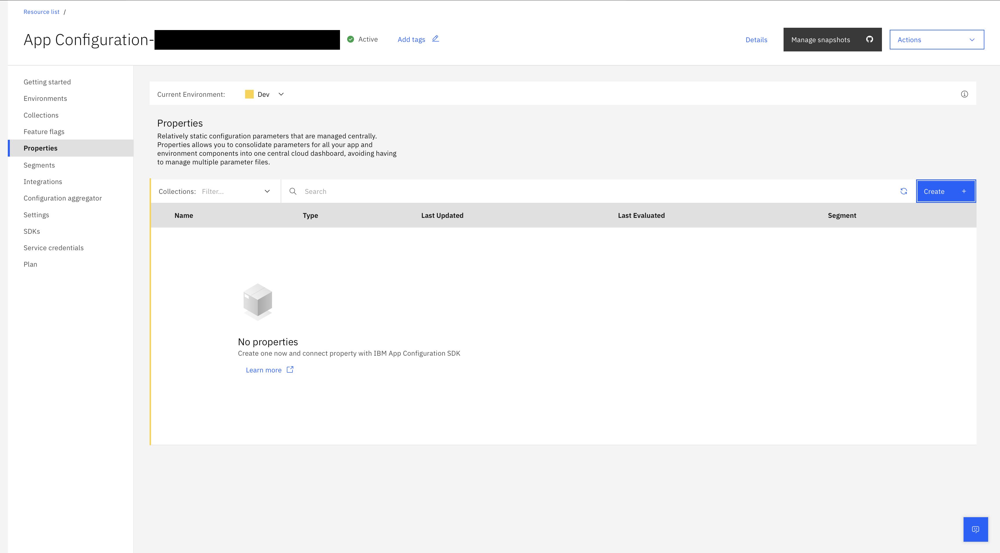
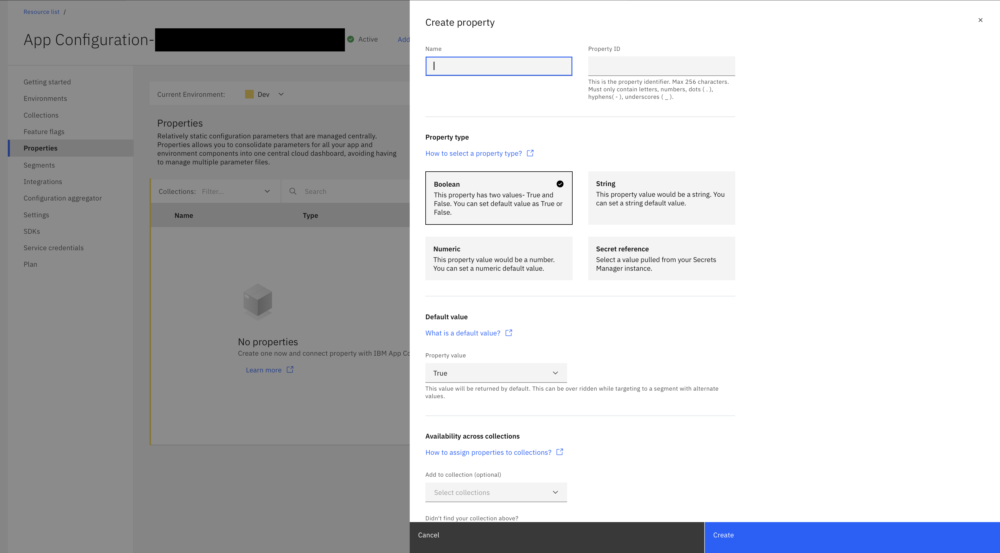
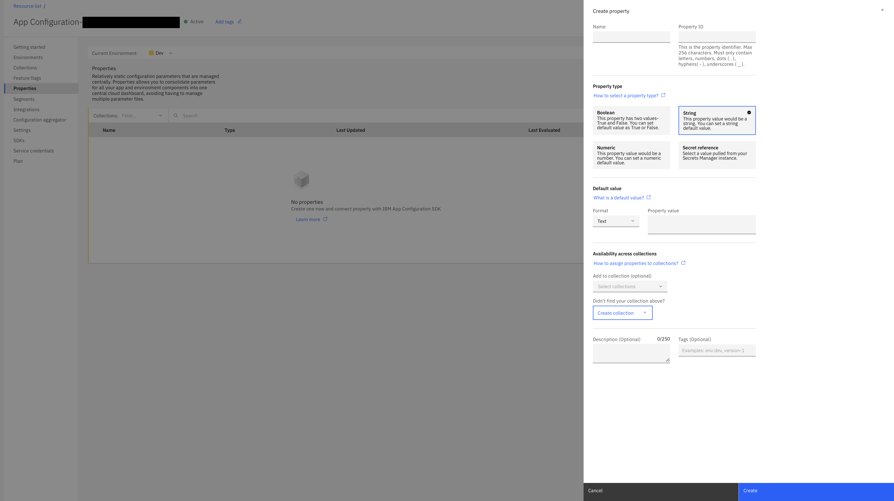
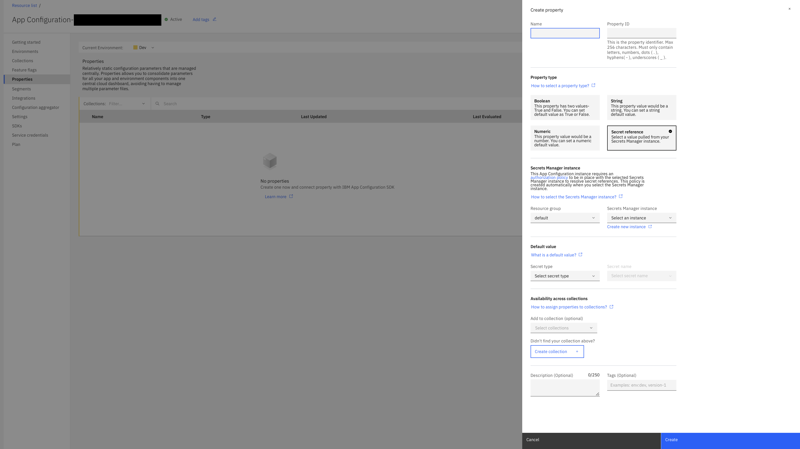
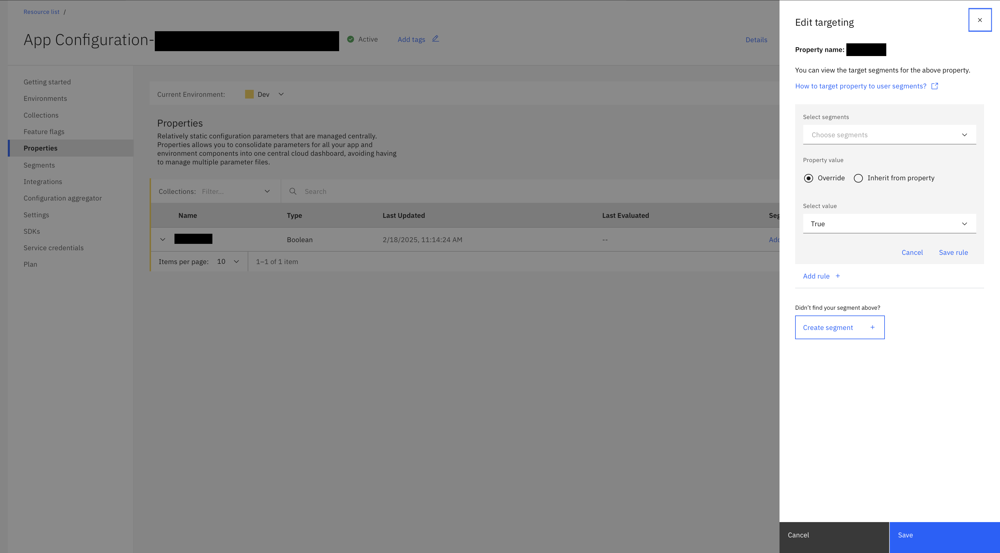
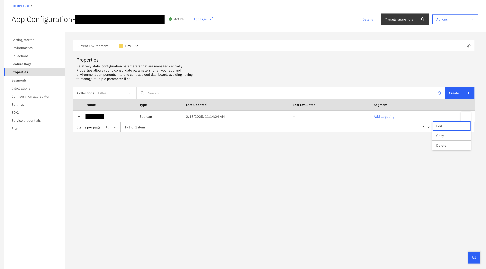

---

copyright:
  years: 2021, 2025
lastupdated: "2025-02-19"

keywords: app-configuration, app configuration, properties, property, create property, secret manager, secret reference

subcollection: app-configuration

---

{{site.data.keyword.attribute-definition-list}}

# Targeting properties to segments
{: #ac-properties}

You can create and manage properties, add them to collections and use them in your app by using SDKs. You can use them in your infrastructure by using [terraform plug-in](https://registry.terraform.io/providers/IBM-Cloud/ibm/latest/docs/resources/app_config_collection){: external} or CLI. Using properties, you can manage the configuration properties of your infrastructure or applications centrally by using {{site.data.keyword.appconfig_short}}.
{: shortdesc}

By default, the properties window lists all properties in an environment in the current {{site.data.keyword.appconfig_short}} service instance. Attributes for each property like **Name**, **Last Updated**, **Last Evaluated**, **Segments** that are targeted, and **Type** are displayed.

Property types:
- A **Boolean** type has two values and you can set the default value as 'true' or 'false'.
- A **String** type property supports data in the form of text, and JSON or YAML files.
- A **Numeric** property supports integer values.
- A **Secret reference** property supports {{site.data.keyword.secrets-manager_short}} integration.

   For selecting **Secret reference** property, you need have a {{site.data.keyword.secrets-manager_short}} instance with Viewer access to the resource group where Secret Manager instance is created or exists. Also, you need to have Reader access to the {{site.data.keyword.secrets-manager_short}} instance.
   {: note}

An example use case of properties can be to decide the number of instances of your application in a specific region. Create a property in {{site.data.keyword.appconfig_short}}, with type as numeric, and assign segments based on region value.

{: caption="List of properties" caption-side="bottom"}

## Create a property
{: #ac-create-properties}

To create a property, complete these steps:

1. In the {{site.data.keyword.appconfig_short}} console, click **Properties**.

1. Select the **Current Environment** to display the list of properties in that environment.

1. Click **Create**. The side panel opens with fields for creating a new property.

   {: caption="Creating a new property" caption-side="bottom"}

1. Provide the property details:
   - **Name** - name of the property.
   - **Property ID** - the property ID value is auto suggested based on the entered property name. You can modify the same, if needed. Use the **Property ID** value as the identifier in your SDK or API code.
   - **Property type** - specify the type of the property. Supported type includes Boolean, String, Numeric, and Secret reference. For more information about property type and default values, see [Selecting property type](#selecting-properties-type).
   - **Default value** - specify the default value for the property type selected. For more information, see [Selecting property type](#selecting-properties-type).
   - Optionally, you can add the property to one or more collections by selecting in the **Add to collection** list.
   - **Description** - add a description of the property, which is optional.
   - Optionally, define **Tags** that can help you to identify the property.

1. Click **Create**.

## Selecting property type
{: #selecting-properties-type}

You can have one of the following property types that is associated to a property:
- Boolean
- String
- Numeric
- Secret reference

Each of the **Property type** is having a default value.
{: #property-type-default-value}

- The value for the **Property value** is required, which can be overridden while targeting to a segment.

### Boolean
{: #property-type-boolean}

When you select the **Property type** as *Boolean*, the **Default value** details are displayed:

{: caption="Property type - Boolean" caption-side="bottom"}

1. Select the **Property value** from the list (*True* or *False*). This value is returned by default and can be overridden when targeting to a segment.

### String
{: #property-type-string}

When you select the **Property type** as *String*, the **Default value** details are displayed:

{: caption="Property type - String" caption-side="bottom"}

1. Specify the **Default value**. This value is returned by default and be overridden while targeting to a segment.

   - **Format**: select the format of the string type from the list. Options are: Text, JSON, and YAML.
   - **Property value**: specify the property value based on the format selected.

### Numeric
{: #property-type-numeric}

When you select the **Property type** as *Numeric*, the **Default value** details are displayed:

{: caption="Property type - Numeric" caption-side="bottom"}

1. Specify the **Property value**. This value is returned by default and can be overridden while targeting to a segment.

### Secret reference
{: #property-type-secret-reference}

When you select the **Property type** as *Secret reference*, the **{{site.data.keyword.secrets-manager_short}} instance**, and **Default value** details are displayed:

{: caption="Property type - Secret reference" caption-side="bottom"}

1. Specify the **{{site.data.keyword.secrets-manager_short}} instance** information from where the values need to be pulled.

   - **Resource group**: select the resource group from where the {{site.data.keyword.secrets-manager_short}} instance to be used.
   - **{{site.data.keyword.secrets-manager_short}} instance**: select the {{site.data.keyword.secrets-manager_short}} instance to be used for the specified property.

1. Specify the **Default value**. This value is returned by default and can be overridden while targeting to a segment.

   - **Secret type**: select the secret type from the list. For more information about secret types, see [Working with secrets of different types](https://{DomainName}/docs/secrets-manager?topic=secrets-manager-what-is-secret&interface=ui#secret-types){: external}.
   - **Secret name**: select the secret name from the dropdown.

## Target collections to properties
{: #collection-target-properties}

You can add properties to one or more collections either during the creation of property or during editing a property details.

For adding collections to the properties, for the **Availability across collections** field, select the collection from the list.

If you try to target a property that is not linked to a collection, a window is displayed to add a property to a collection.
{: note}

## Targeting a segment with properties
{: #targeting-segment-with-properties}

You can roll out property to one or more target segments. You can set different property values for different segments, if needed.

1. From the {{site.data.keyword.appconfig_short}} console, go to **Properties** to display the list of properties available in the current environment of the {{site.data.keyword.appconfig_short}} service instance.

1. Click **Add targeting** in the required property row to display the **Target property to segments** side panel.

   {: caption="Target property to segments" caption-side="bottom"}

1. Select **Segments** from the list. If no segments are available to target, click **Create segment**. For more information about creating a segment, see [Create a segment](/docs/app-configuration?topic=app-configuration-ac-segments#ac-create-segment).

1. Select the **Property value** (Inherited from property or Override).

1. Click **Save rule** to save the changes to the rules.

1. Click **Add targeting**.

If you try to target a property that is not linked to a collection, a window is displayed to add a property to a collection.
{: note}

## Properties - overflow menu
{: #properties-overflow-menu}

The overflow menu for each of the property (three vertical dots) consists of **Edit**, **Copy**, and **Delete** operations and **Remove targeting** for already targeted property.

{: caption="Overflow menu for a property" caption-side="bottom"}

- When **Edit** is selected, you can change the **Name**, and **Description**, add or delete **Tags**, change the **Property type** and **Default value**, and add or remove collections for the **Availability across collections** field information.
- When **Copy** is selected, the property information is copied, and you need to modify the **Name** of the property. Optionally, modify the other details based on your need.
- When **Delete** is selected, a confirmation window is displayed to seek confirmation to delete the selected property. Deleting option permanently deletes the property and the action cannot be undone.
- In the list of property, in a property, when **Copy to clipboard** icon is clicked, the property's **Property ID** value is copied to the clipboard.
- **Remove targeting** removes the targeting of properties to a segment.
