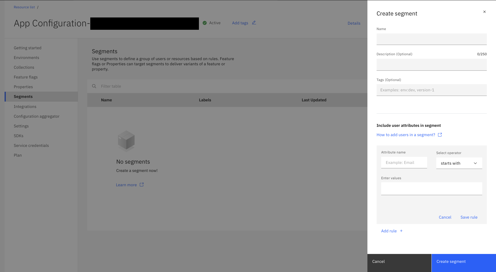

---

copyright:
  years: 2020, 2022
lastupdated: "2022-07-14"

keywords: app-configuration, app configuration, segments

subcollection: app-configuration

---

{{site.data.keyword.attribute-definition-list}}

# Segments
{: #ac-segments}

Use segments to define a group of users or resources based on rules. Feature flags can target segments to deliver variants of a feature based on the needs like beta launches and experiments.
{: shortdesc}

By default, the Segments pane displays the list of segments that are created in the current {{site.data.keyword.appconfig_short}} service instance along with Name of the segment, tags, and date of creation.

{: caption="Figure 1. List of segments" caption-side="bottom"}

## Create a segment
{: #ac-create-segment}

To create a segment, complete these steps:

1. In the {{site.data.keyword.appconfig_short}} console, click **Segments**. 

1. Click **Create**. The side-panel opens with fields for creating a new segment.

   {: caption="Figure 2. Creating a new segment" caption-side="bottom"}

1. Provide the segment details: 
   - **Name** - name of the segment. 
   - **Description** - add a description of the segment, which is optional.
   - Optionally, define **Tags** that are required to identify with the segment.
   - Specify a rule for including users to a segment in the **Include user attributes in segment**. For further details about adding users to a segment, refer [here](#adding-users-to-segment).

1. Click **Create**.

## Adding user in a segment
{: #adding-users-to-segment}

You can add user attributes in a segment by defining rules. You can define more than one rule.

To define a rule, at the time of creating or editing a segment, in **Include user attributes in segment**, add the following details:

1. Add an **Attribute name**.

1. Select an operator to be used for the evaluation from the list.
   - starts with
   - ends with
   - is
   - contains
   - greater than
   - greater than and equals
   - less than
   - less than and equals

1. **Enter values** for the operator selected.

1. Click **Save rule**.

## Segments - overflow menu
{: #segments-overflow-menu}

The overflow menu for each of the segments (three vertical dots) consists of **Edit**, **Copy**, and **Delete** operations.

{: caption="Figure 3. Overflow menu for a segment" caption-side="bottom"}

- When **Edit** option is selected, you can make changes to the **Name**, **Description**, add or modify the rule for **Including user attributes in segment**.
- When **Copy** option is selected, the segment information is copied and you need to modify the **Name** of the segment. Optionally, modify the other details based on your need.
- When **Delete** option is selected, a confirmation window is displayed to seek confirmation to delete the selected segment. Deleting option will permanently delete the segment information and the action cannot be undone.

For targeting feature flags to segments, refer [here](/docs/app-configuration?topic=app-configuration-ac-feature-flags#targeting-segment-with-feature-flag).
