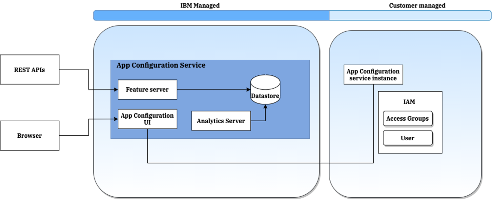

---

copyright:
  years: 2020
lastupdated: "2021-08-25"

keywords: public isolation for app configuration, compute isolation for app configuration, app configuration architecture, workload isolation in app configuration

---

{:external: target="_blank" .external}
{:shortdesc: .shortdesc}
{:table: .aria-labeledby="caption"}
{:tip: .tip}
{:important: .important}
{:note: .note}

_Name your file `architecture-workload-isolation.md` and include it in the **How to** nav group in the **Enhancing security** topic group in your `toc` file. See https://test.cloud.ibm.com/docs/writing?topic=writing-security-content-guidance_

_Make sure that you use the following title for your topic._

# Learning about {{site.data.keyword.appconfig_short}} architecture and workload isolation
{: #compute-isolation}
<!-- The title of your H1 should be Learning about _servicename_ architecture and workload isolation, where _service-name_ is the non-trademarked short version conref, but the first occurrence in your topic is the trademarked version. Include your service name as a search keyword at the top of your Markdown file. See the example keywords above. -->

_The short description should be a single, concise paragraph that contains one or two sentences and no more than 50 words. Summarize your offering's architecture and support for isolating one tenants' workload from another._

Learn about the {{site.data.keyword.appconfig_full}} service architecture, the service dependencies,
and how customer workloads are isolated from each other in {{site.data.keyword.appconfig_short}} instances.
{: shortdesc}

## {{site.data.keyword.appconfig_short}} architecture
{: #architecture}

{{site.data.keyword.appconfig_notm}} service  is offered in the regions: Dallas, London, and Sydney. Every region supported, has its own {{site.data.keyword.Bluemix_notm}} Kubernetes Service cluster with several worker nodes. Each worker node runs several instances of {{site.data.keyword.appconfig_short}} service components. Each region is fronted by a global load balancer and a web application firewall.

{{site.data.keyword.appconfig_short}} service persists tenant data in highly available database. A single regional database is used to store the data of all tenants in that particular region.

The data is stored across multiple zones in each region for high availability. Data that is stored is encrypted and persisted in a database cluster that is spread across availability zones. All databases connections use TLS/SSL encryption for data in transit.

{: caption="{{site.data.keyword.appconfig_notm}} architecture" caption-side="bottom"}

The Feature server component provides the API interface to the {{site.data.keyword.appconfig_short}} service.

The datastore component stores all configuration, metrics, instance details, and environments data.

The {{site.data.keyword.appconfig_short}} UI is the front-end component which can be used to manage the
configuration data.

Analytics server component collects the usage metrics for configuration data and stores it to the data store at instance level.

## {{site.data.keyword.appconfig_short}} workload isolation
{: #workload-isolation}

Each regional deployment of the {{site.data.keyword.appconfig_full}} serves multiple tenants that are identified by the {{site.data.keyword.IBM_notm}}service instance.

- The {{site.data.keyword.appconfig_notm}} service in a region is a multi-tenant highly available service.
- The configuration data that is collected and processed by the {{site.data.keyword.appconfig_notm}} service is associated with the service instance created by a tenant and not visible to the other service instances by virtue of this association.
- Data for all tenants are co-located in the same data stores and segmented by the tenant-specific instance <i>guid</i>. Retrieval of tenant-specific data is enforced by access control policies.